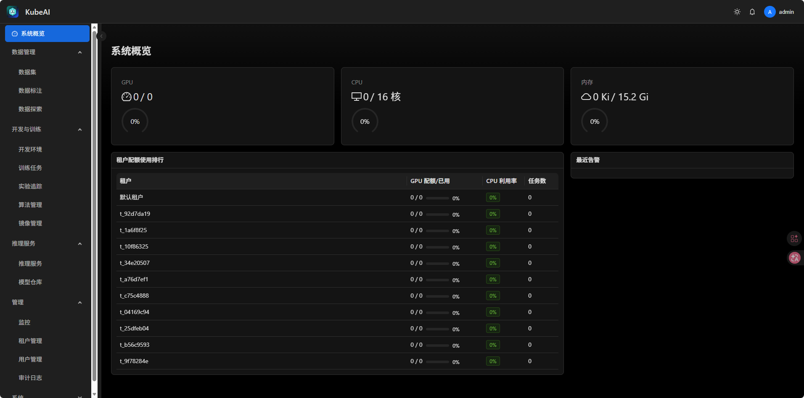

<p align="center">
  <h1 align="center">KubeAI</h1>
  <p align="center">
    <strong>Kubernetes 原生 AI/ML 平台 —— 训练、推理、标注、实验追踪，一站闭环</strong>
  </p>
</p>

<p align="center">
  
  
  
  
  
  
</p>

---



## 项目简介

KubeAI 是一款**面向企业级 Kubernetes 环境的一站式 AI/ML 平台**，将模型开发全生命周期——数据探索、模型训练、模型仓库、推理服务、实验追踪、数据标注——统一纳管到单个控制面，并以细粒度多租户 RBAC 贯穿始终。

**为什么还需要一个 ML 平台？** 当前开源生态不缺优秀组件：Volcano 做批量调度、KEDA 做弹性伸缩、MLflow 做实验追踪、Label Studio 做数据标注。但把这些拼到一起，还需要自己解决统一认证、多租户隔离、权限管控、前端界面和运维部署这些"看不见"的工程问题。KubeAI 的价值正在于此：**把这些久经考验的 Kubernetes 原生组件无缝集成为一个整体**，对外提供统一的身份认证、四级 RBAC 权限体系和开箱即用的 Web 管理界面，让 ML 团队不必折腾基础设施，专注模型本身。

### 平台规模一览

| 维度 | 规模 |
|------|------|
| 后端 API 端点 | 26 个路由模块，覆盖全部功能域 |
| 业务服务层 | 25+ Service 模块，构造器注入式设计 |
| 数据模型 | 17 个 ORM 实体，覆盖用户、租户、训练、推理、标注等 |
| 前端页面 | 20+ 页面模块，React 18 + TypeScript strict 模式 |
| 异步任务 | Taskiq Worker + Scheduler 双进程，Redis Streams 消息驱动 |
| K8s 集成 | 9 个外部系统客户端，全异步 kubernetes_asyncio SDK |

---

## 核心能力

### 模型全生命周期

| 环节 | 核心能力 |
|------|----------|
| **数据探索** | 接入 MySQL、PostgreSQL、Hive、SQL Server 等外部数据库，在线编写 SQL 并实时浏览查询结果 |
| **数据管理** | 数据集上传、版本管理，租户隔离存储，底层基于 hostPath 卷挂载，直接挂入训练/开发 Pod |
| **模型仓库** | 模型版本注册、元数据管理、制品存储（MinIO），一键发布至推理服务 |
| **训练任务** | 基于 **Volcano VCJob** 提交分布式训练，支持 GPU 调度、优先级队列、日志实时流式查看、TensorBoard 侧车 |
| **实验追踪** | 集成 **MLflow** 管理实验与 Run，跨实验对比指标、参数和产出物 |
| **推理服务** | 基于 K8s 原生 Deployment + ClusterIP Service 部署推理服务，可选 **KEDA** 弹性伸缩（支持 GPU / CPU 指标驱动）；模型直接从 hostPath 加载，零拷贝启动。存储层当前基于 hostPath，后续可平滑迁移至 NFS / CephFS 等分布式存储 |
| **算法管理** | 上传、版本化管理训练算法包（`.tar.gz` / Git 源），与训练任务联动 |

### 数据标注平台

- 集成 **Label Studio** 标注引擎，支持图像分类、目标检测、语义分割、文本分类、视频标注、音频标注
- 自研标注模板系统，结构化配置管理，模板可复用
- 标注画布内置 Konva（图像区域标注）、WaveSurfer.js（音频标注）、PDF.js（文档查看）
- 标注任务分配与进度追踪，与模型训练形成数据闭环

### 交互式开发环境

- 一键启动 **Jupyter**、**VS Code**、**RStudio** 开发容器，基于原生 K8s Pod
- 租户隔离工作区，自动挂载模型与数据集目录，开箱即用
- 支持自定义镜像（Harbor 构建 + 推送），空闲超时自动停止
- APISIX 动态路由注入，开发环境即开即访问

### 业务算法引擎（可选模块）

面向运筹优化场景的业务算法模块，支持：
- 数据规划与预处理流水线
- 启发式规则引擎配置
- 元启发式优化求解，甘特图可视化资源分配

### 平台底座

| 模块 | 能力 |
|------|------|
| **认证** | JWT (HS256) + Redis 令牌黑名单机制；登录失败锁定（5 次/15 分钟）；支持 OIDC/OAuth2 单点登录；用户自助注册与邀请制加入租户 |
| **权限** | 基于 Casbin 的多租户 RBAC，四级角色：管理员 > MLOps > 工程师 > 标注员；`资源:操作` 粒度权限字符串；前端路由级 + 后端端点级双重鉴权 |
| **多租户** | DB 级 FK 数据隔离 + K8s 命名空间隔离（`kubeai-` 前缀）；租户级 GPU/CPU/内存/存储资源配额管理；配额支持跨租户调配 |
| **可观测性** | Prometheus + DCGM Exporter GPU 指标采集；structlog 结构化日志；全操作审计追踪（CRUD + 登录/角色/配额变更）；WebSocket 实时事件推送 |
| **通知中心** | 训练任务完成/失败、配额告警、标注任务分配、推理服务状态变更等事件通知；多副本部署下通过 Redis Pub/Sub 实现 WebSocket 跨实例广播 |
| **镜像仓库** | Harbor 集成，支持自定义训练/推理/开发环境镜像构建（Kaniko on K8s） |
| **总览仪表盘** | 租户级聚合视图——集群概况、近期任务/数据集/服务、标注进度、租户排名、待处理告警 |

---

## 架构总览

```
┌──────────────────────────────────────────────────────────────────┐
│                          KubeAI 前端                              │
│              React 18 · Ant Design 5 Pro · Zustand               │
│                  TanStack Query · Tailwind CSS                    │
└────────────────────────────────┬─────────────────────────────────┘
                                 │ REST + WebSocket (token auth)
┌────────────────────────────────▼─────────────────────────────────┐
│                       KubeAI API (FastAPI)                        │
│      认证 JWT · 鉴权 Casbin · 身份解析 (Redis Cache) · 租户中间件     │
│   ┌──────────┬──────────┬──────────┬──────────┬────────────────┐ │
│   │  训练任务  │  推理服务  │  数据集   │  模型仓库  │    标注平台     │ │
│   │ (Volcano) │(K8s+KEDA)│          │ (MinIO)  │ (LabelStudio)  │ │
│   └──────────┴──────────┴──────────┴──────────┴────────────────┘ │
│   ┌──────────┬──────────┬──────────┬──────────┬────────────────┐ │
│   │  开发环境  │  实验追踪  │  镜像管理  │  运维监控  │   审计 & 通知   │ │
│   │(K8s Pod) │ (MLflow) │ (Harbor) │(Prometheus)│              │ │
│   └──────────┴──────────┴──────────┴──────────┴────────────────┘ │
│           Taskiq Worker (异步任务) + Scheduler (定时调度)           │
│                   Redis Streams 消息驱动                            │
└────────────────────────────────┬─────────────────────────────────┘
                                 │ kubernetes_asyncio
┌────────────────────────────────▼─────────────────────────────────┐
│                       Kubernetes 集群                              │
│  ┌─────────┐ ┌──────────┐ ┌─────────┐ ┌─────────┐ ┌───────────┐ │
│  │ Volcano │ │   KEDA   │ │ Harbor  │ │  MinIO  │ │  APISIX   │ │
│  │ (VCJob) │ │ (弹性伸缩) │ │(镜像仓库) │ │(对象存储) │ │ (API网关)  │ │
│  └─────────┘ └──────────┘ └─────────┘ └─────────┘ └───────────┘ │
│  ┌──────────┐ ┌─────────┐ ┌───────────┐ ┌──────────────────────┐ │
│  │PostgreSQL│ │  Redis  │ │Prometheus │ │    Label Studio      │ │
│  │   17     │ │    7    │ │  + DCGM   │ │    (数据标注引擎)      │ │
│  └──────────┘ └─────────┘ └───────────┘ └──────────────────────┘ │
│  ┌──────────────────────────────────────────────────────────────┐ │
│  │  Jupyter / VS Code / RStudio Pod  (原生 K8s, 租户隔离)        │ │
│  └──────────────────────────────────────────────────────────────┘ │
└──────────────────────────────────────────────────────────────────┘
```

---

## 技术栈

| 层级 | 选型 | 说明 |
|------|------|------|
| **API 服务** | Python 3.12 · FastAPI · SQLAlchemy 2.0 (async) · Pydantic v2 | 全异步，`BaseResponse[T]` 统一响应封装 |
| **前端** | React 18 · TypeScript strict · Ant Design 5 Pro · Zustand · TanStack Query · Tailwind CSS | snake↔camel 自动转换 |
| **数据库** | PostgreSQL 17 + asyncpg 异步驱动 · Alembic 迁移 | 同时承载 MLflow / Label Studio 元数据库 |
| **缓存 / 消息** | Redis 7 | 令牌黑名单、身份缓存、Taskiq 消息代理、WebSocket Pub/Sub 跨实例广播 |
| **异步任务** | Taskiq · Redis Streams | Worker 执行异步任务，Scheduler 单副本定时调度 |
| **权限模型** | Casbin + SQLAlchemy Adapter | 四级角色，`resource:action` 权限字符串 |
| **K8s 客户端** | kubernetes_asyncio | 全异步，直接操作原生 K8s 资源 |
| **对象存储** | MinIO | S3 兼容，数据集 & 模型制品存储 |
| **镜像仓库** | Harbor | 自定义镜像构建（Kaniko）与管理 |
| **API 网关** | APISIX | 开发环境动态路由，生产入口流量管理 |
| **批量调度** | Volcano | GPU 训练任务调度、优先级队列 |
| **弹性伸缩** | KEDA | 推理服务自动扩缩容 |
| **实验追踪** | MLflow | 实验管理、指标对比 |
| **数据标注** | Label Studio | 多模态标注引擎 |
| **GPU 监控** | Prometheus + DCGM Exporter + Grafana | GPU 利用率、显存、温度等指标 |
| **开发环境** | K8s 原生 Pod | Jupyter / VS Code / RStudio 容器化 |

---

## 应用场景

| 场景 | 对应能力 |
|------|----------|
| **分布式模型训练** | 提交 GPU 训练任务到 Volcano 队列，实时监控日志与 GPU 指标，训练产出自动注册到模型仓库 |
| **模型服务化部署** | 模型仓库一键发布推理服务，KEDA 按 GPU / CPU 指标自动扩缩，当前基于 hostPath 加载模型，后续可迁移至分布式存储 |
| **数据标注流水线** | 创建标注项目 → 配置模板 → 分配任务 → 标注产出回流训练，形成数据闭环 |
| **算法研发协作** | 多租户隔离 + 四级角色权限，不同团队/角色在统一平台上协作，数据不越界 |
| **MLOps 实验管理** | MLflow 追踪每次训练实验，跨实验对比指标，快速定位最优超参 |
| **GPU 资源治理** | 租户级 GPU 配额管控，配额可跨租户调配，DCGM 实时采集 GPU 利用率，避免资源浪费 |

---

## 快速开始

### 环境要求

| 工具 | 版本 | 说明 |
|------|------|------|
| Python | 3.12+ | 配合 [uv](https://docs.astral.sh/uv/) 包管理 |
| Node.js | 20+ | pnpm（`corepack enable && corepack prepare pnpm@latest --activate`） |
| Kubernetes | — | kind / minikube / Docker Desktop 均可 |
| Helm | 3.8+ | 仅本地开发使用；生产用原生 manifests |

### 1. 部署基础设施依赖

Helm 一键拉起本地开发所需的全部基础服务：

```bash
helm repo add jetstack https://charts.jetstack.io
helm repo add bitnami https://charts.bitnami.com/bitnami
helm repo add volcano-sh https://volcano-sh.github.io/helm-charts
helm repo add kedacore https://kedacore.github.io/charts
helm repo add prometheus-community https://prometheus-community.github.io/helm-charts
helm repo add nvidia https://nvidia.github.io/dcgm-exporter/helm-charts
helm repo add harbor https://helm.goharbor.io
helm dependency update infra/helm/kubeai/

helm upgrade --install kubeai infra/helm/kubeai/ \
  -f infra/helm/kubeai/values-dev.yaml \
  -n kubeai --create-namespace
```

> 部署内容：PostgreSQL · Redis · MinIO · Volcano · KEDA · Harbor · APISIX · MLflow · Label Studio · Prometheus + DCGM · cert-manager

### 2. 启动后端

```bash
cd backend
cp .env.example .env              # 按需修改数据库 / Redis / MinIO 连接地址
uv sync
uv run alembic upgrade head       # 执行数据库迁移

# 三个终端分别启动：
uv run uvicorn app.main:app --reload                                    # API 服务 → :8000
uv run taskiq worker app.core.taskiq_app:broker --fs-discover            # 异步 Worker
uv run taskiq scheduler app.core.taskiq_app:scheduler --skip-first-run   # 定时调度
```

### 3. 启动前端

```bash
cd frontend
pnpm install
pnpm dev                           # → :3000，自动代理 /api → localhost:8000
```

### 默认管理员账号

首次启动自动创建：**`admin`** / **`Admin@123456`**

---

## 项目结构

```
KubeAI/
├── backend/                         # FastAPI 后端应用
│   ├── app/
│   │   ├── api/                     # 路由层 — 26 个端点模块
│   │   │   └── endpoints/           #   auth, users, tenants, datasets, training_jobs,
│   │   │                           #   inference_services, experiments, model_registry,
│   │   │                           #   annotations, annotation_templates, algorithms,
│   │   │                           #   images, dev_environments, monitoring, dashboard,
│   │   │                           #   audit_logs, notifications, credentials,
│   │   │                           #   db_connections, query_results, filesystem, ws ...
│   │   ├── core/                    # 配置 · 安全 · RBAC (Casbin) · 身份解析 · 客户端管理
│   │   ├── integrations/            # K8s · Volcano · Harbor · MinIO · MLflow · LabelStudio 等
│   │   ├── middleware/              # RequestId · Tenant · ErrorHandler
│   │   ├── models/                  # SQLAlchemy 2.0 ORM（17 个实体）
│   │   ├── schemas/                 # Pydantic v2 请求/响应模型
│   │   ├── services/                # 业务逻辑层（25+ 服务，构造器注入）
│   │   └── tasks/                   # Taskiq 异步任务（训练/推理/镜像/开发环境/监控/标注）
│   ├── alembic/                     # 数据库迁移
│   └── tests/                       # pytest（单元 + 集成）
├── frontend/                        # React 18 SPA
│   ├── src/
│   │   ├── components/              # 通用组件（AuthGuard, PermissionGuard, LogStream 等）
│   │   ├── pages/                   # 页面模块（20+ 页面）
│   │   ├── services/                # Axios API 客户端（snake↔camel 自动转换）
│   │   ├── stores/                  # Zustand（auth, rbac, tenant, theme, notification, ws）
│   │   └── hooks/                   # 自定义 Hooks
│   └── tests/                       # Vitest + Testing Library
├── infra/
│   ├── helm/kubeai/                 # Helm Chart（本地开发基础设施，8 子 Chart + 自定义模板）
│   ├── k8s/                         # 生产环境 K8s 资源清单（API/Worker/Scheduler 分离部署）
│   └── images/                      # Dockerfile（backend, frontend, jupyter, vscode, rstudio）
└── docs/                            # MkDocs + Material 主题项目文档
```

---

## 开发命令速查

```bash
# === 后端 ===
cd backend
uv run pytest -v                          # 执行测试
uv run ruff check . && ruff format .      # 代码检查 + 格式化
uv run mypy app/                          # 类型检查
uv run alembic revision --autogenerate -m "描述"   # 生成迁移
uv run alembic upgrade head               # 执行迁移

# === 前端 ===
cd frontend
pnpm lint                                 # ESLint 9 flat config
pnpm typecheck                            # TypeScript 严格模式检查
pnpm test                                 # Vitest + jsdom

# === 镜像构建 ===
docker build -t kubeai-backend -f infra/images/backend/Dockerfile .
docker build -t kubeai-frontend -f infra/images/frontend/Dockerfile .

# === 文档 ===
cd backend && uv sync --group docs
uv run mkdocs serve --config-file ../mkdocs.yml
```

---

## 部署说明

| 环境 | 方式 | 说明 |
|------|------|------|
| **本地开发** | Helm Chart (`infra/helm/kubeai/`) | 仅部署基础设施依赖，前后端在集群外 `uvicorn` / `pnpm dev` 运行 |
| **生产环境** | 原生 K8s manifests (`infra/k8s/`) | API · Worker · Scheduler 独立 Deployment，共享 ConfigMap/Secret，可独立扩缩 |

### 生产部署架构

```
                   APISIX Gateway
                         │
          ┌──────────────┼──────────────┐
          ▼              ▼              ▼
    /api → Backend   /ws → Backend   /* → Frontend
    (Deployment,     (WebSocket       (Nginx, 代理
     HPA 水平伸缩)     直接转发)         /api /ws)
          │
          ├── Taskiq Worker (独立 Deployment, 按任务吞吐扩缩)
          └── Taskiq Scheduler (单副本, 定时调度)
```

Worker 负责：开发环境创建/销毁、环境状态同步、空闲检测、推理服务部署/更新/删除、训练任务资源清理。

Scheduler 负责：状态同步轮询、空闲环境检查、历史资源定时清理。

---

## 文档

完整文档请查阅 `docs/` 目录（MkDocs + Material 主题）：

| 文档 | 说明 |
|------|------|
| [快速开始](docs/getting-started/) | 环境搭建与开发指南 |
| [架构设计](docs/architecture/) | 系统架构与设计理念 |
| [功能模块](docs/features/) | 各功能模块使用说明 |
| [API 参考](docs/api/) | REST API 接口文档 |
| [部署运维](docs/deployment/) | 生产部署与运维手册 |
| [开发指南](docs/development-guide/) | 编码规范与最佳实践 |
