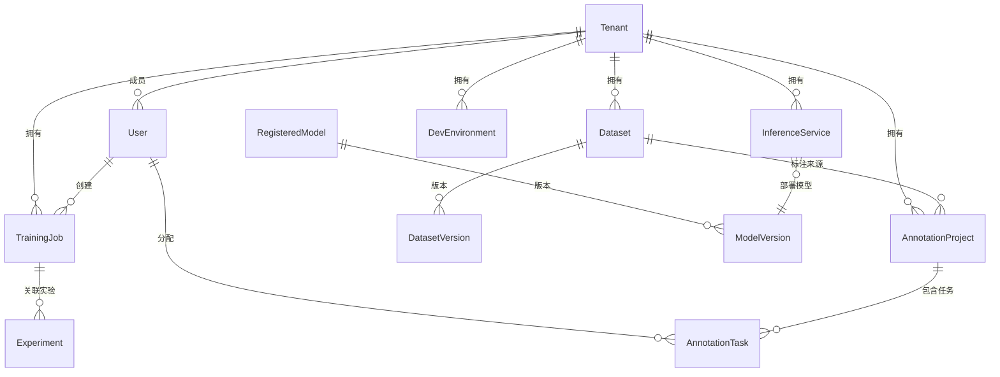

# 数据模型

## 模型基础设施

所有数据模型继承自 `DeclarativeBase`，使用 SQLAlchemy 2.0 声明式映射。

### 公共 Mixin

| Mixin | 提供字段 | 说明 |
|-------|----------|------|
| `TimestampMixin` | `created_at`, `updated_at` | 自动管理时间戳 |
| `TenantMixin` | `tenant_id` | 多租户隔离，外键关联 `tenants.id` |
| `SoftDeleteMixin` | `deleted_at` | 软删除（User 模型使用） |

### 枚举类型

所有枚举使用 `StrEnum` 定义（Python 3.12+），存储为字符串：

| 枚举 | 值 |
|------|------|
| `UserRole` | admin, mlops, engineer, annotator |
| `BuildStatus` | pending, building, succeeded, failed |
| `TrainingJobStatus` | pending, running, succeeded, failed, stopped |
| `InferenceStatus` | deploying, running, stopped, failed |
| `AnnotationStatus` | not_started, in_progress, completed |
| `ResourceType` | cpu, memory, gpu, storage |

## 实体关系图



## 核心数据模型

### Tenant（租户）

| 字段 | 类型 | 说明 |
|------|------|------|
| `id` | UUID | 主键 |
| `name` | String(100) | 租户名称（唯一） |
| `display_name` | String(200) | 显示名称 |
| `description` | Text | 描述 |
| `k8s_namespace` | String(100) | Kubernetes 命名空间 |
| `cpu_quota` | Float | CPU 配额 |
| `memory_quota` | Float | 内存配额（GB） |
| `gpu_quota` | Integer | GPU 配额 |
| `storage_quota` | Float | 存储配额（GB） |
| `is_active` | Boolean | 是否启用 |

### User（用户）

| 字段 | 类型 | 说明 |
|------|------|------|
| `id` | UUID | 主键 |
| `username` | String(50) | 用户名（唯一） |
| `email` | String(200) | 邮箱（唯一） |
| `hashed_password` | String | bcrypt 哈希密码 |
| `role` | UserRole | 全局角色 |
| `tenant_id` | UUID | 所属租户 |
| `is_active` | Boolean | 是否启用 |
| `deleted_at` | DateTime | 软删除时间 |

### Dataset & DatasetVersion

| Dataset 字段 | 类型 | 说明 |
|---------------|------|------|
| `id` | UUID | 主键 |
| `name` | String(200) | 数据集名称 |
| `description` | Text | 描述 |
| `type` | StrEnum | 数据集类型 |
| `tenant_id` | UUID | 所属租户 |

| DatasetVersion 字段 | 类型 | 说明 |
|---------------------|------|------|
| `id` | UUID | 主键 |
| `dataset_id` | UUID | 关联数据集 |
| `version` | String(50) | 版本号 |
| `storage_path` | String | MinIO 存储路径 |
| `file_count` | Integer | 文件数量 |
| `size_bytes` | BigInteger | 总大小 |

### TrainingJob（训练任务）

| 字段 | 类型 | 说明 |
|------|------|------|
| `id` | UUID | 主键 |
| `name` | String(200) | 任务名称 |
| `status` | TrainingJobStatus | 状态 |
| `framework` | String | 框架（PyTorch/TensorFlow） |
| `image` | String | 训练镜像 |
| `command` | Text | 训练命令 |
| `resources` | JSON | 资源请求（CPU/GPU/Memory） |
| `volcano_job_name` | String | Volcano VCJob 名称 |
| `vcjob_phase` | String | Volcano 任务阶段 |

### InferenceService（推理服务）

| 字段 | 类型 | 说明 |
|------|------|------|
| `id` | UUID | 主键 |
| `name` | String(200) | 服务名称 |
| `status` | InferenceStatus | 状态 |
| `model_name` | String | 模型名称 |
| `model_version` | String | 模型版本 |
| `framework` | String | 推理框架 |
| `resource_config` | JSON | 资源配置 |
| `autoscaling_config` | JSON | 自动扩缩容配置 |
| `canary_config` | JSON | 金丝雀发布配置 |
| `k8s_name` | String | KServe 服务名称 |

### AnnotationProject & AnnotationTask

| AnnotationProject 字段 | 类型 | 说明 |
|------------------------|------|------|
| `id` | UUID | 主键 |
| `name` | String(200) | 项目名称 |
| `project_type` | StrEnum | 标注类型 |
| `label_config` | JSON | 标签配置 |
| `dataset_id` | UUID | 关联数据集 |
| `ls_project_id` | Integer | Label Studio 项目 ID |

| AnnotationTask 字段 | 类型 | 说明 |
|---------------------|------|------|
| `id` | UUID | 主键 |
| `project_id` | UUID | 关联项目 |
| `assignee_id` | UUID | 分配的标注员 |
| `status` | AnnotationStatus | 任务状态 |
| `data` | JSON | 标注数据 |

### RegisteredModel & ModelVersion

| RegisteredModel 字段 | 类型 | 说明 |
|----------------------|------|------|
| `id` | UUID | 主键 |
| `name` | String(200) | 模型名称 |
| `description` | Text | 描述 |
| `framework` | String | 框架 |

| ModelVersion 字段 | 类型 | 说明 |
|-------------------|------|------|
| `id` | UUID | 主键 |
| `model_id` | UUID | 关联模型 |
| `version` | String(50) | 版本号 |
| `storage_path` | String | MinIO 存储路径 |
| `metrics` | JSON | 模型指标 |
| `source` | String | 来源（上传/训练产出） |

## 数据库迁移

使用 Alembic 管理数据库迁移，迁移文件位于 `backend/alembic/versions/`：

```bash
# 查看迁移状态
uv run alembic current

# 应用所有迁移
uv run alembic upgrade head

# 回退一个版本
uv run alembic downgrade -1

# 自动生成迁移（基于模型变更）
uv run alembic revision --autogenerate -m "add_new_table"

# 手动创建空迁移
uv run alembic revision -m "custom_migration"
```

当前共有 38+ 迁移文件，覆盖从初始表创建到最新功能的所有数据库变更。
