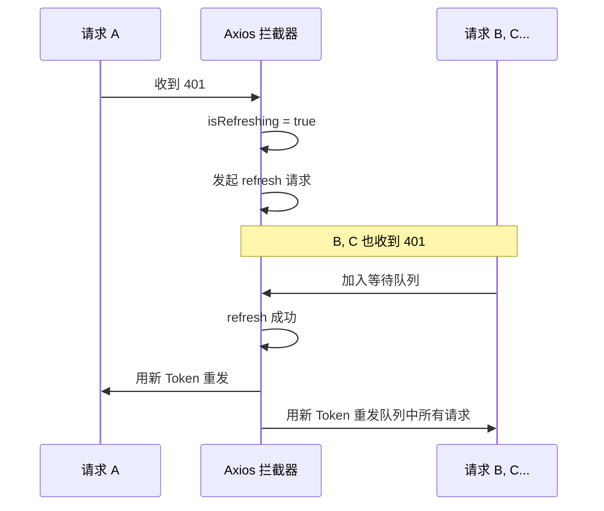

# 前端架构

## 技术栈

| 技术 | 版本 | 用途 |
|------|------|------|
| React | 18 | UI 框架 |
| TypeScript | 5.8 | 类型安全 |
| Ant Design | 5 | UI 组件库 |
| ProComponents | - | 高级业务组件 |
| Tailwind CSS | 3 | 实用优先 CSS |
| Zustand | 5 | 客户端状态管理 |
| TanStack React Query | 5 | 服务端状态缓存 |
| React Router | 7 | 路由管理 |
| Axios | 1.9 | HTTP 客户端 |
| Vite | 6 | 构建工具 |
| Konva | 10 | Canvas 标注渲染 |

## 目录结构

```
frontend/src/
├── App.tsx                 # 根组件（路由定义 + Provider 层级）
├── main.tsx                # 入口文件
├── components/             # 共享组件（10+）
│   ├── AuthGuard/          # 认证路由守卫
│   ├── PermissionGuard/    # RBAC 权限守卫
│   ├── ErrorBoundary/      # 错误边界
│   ├── LogStream/          # 实时日志流
│   ├── GpuMetricsChart/    # GPU 指标图表
│   └── ...
├── pages/                  # 页面组件（20+ 页面）
│   ├── dashboard/          # 仪表盘
│   ├── datasets/           # 数据集
│   ├── training-jobs/      # 训练任务
│   ├── inference/          # 推理服务
│   ├── annotations/        # 数据标注（含 Canvas 工作台）
│   ├── dev-environments/   # 开发环境
│   └── ...
├── services/               # API 服务层（19 个模块）
├── stores/                 # Zustand 状态管理（6 个 Store）
├── hooks/                  # 自定义 Hooks
├── layouts/                # 布局组件
├── types/                  # TypeScript 类型定义
├── utils/                  # 工具函数
└── styles/                 # 全局样式
```

## Provider 层级

应用根组件嵌套以下 Provider：

```
ConfigProvider (Ant Design 主题 + zhCN 语言包)
  └── AntApp (message / modal 上下文)
       └── QueryClientProvider (TanStack Query)
            └── BrowserRouter
                 └── Suspense (懒加载 fallback)
                      └── 路由组件
```

## 路由系统

所有页面使用 `React.lazy()` 懒加载，支持嵌套路由和权限守卫：

```typescript
// 路由示例
{
  path: "/training-jobs",
  element: <PermissionGuard permission="training_jobs:read"><TrainingJobsPage /></PermissionGuard>,
  children: [
    { index: true, element: <TrainingJobsPage /> },
    { path: "create", element: <CreateTrainingJobPage /> },
    { path: ":id", element: <TrainingJobDetailPage /> },
  ]
}
```

主要路由模块：

| 路径 | 页面 | 权限 |
|------|------|------|
| `/dashboard` | 仪表盘 | - |
| `/datasets` | 数据集管理 | `datasets:read` |
| `/training-jobs` | 训练任务 | `training_jobs:read` |
| `/experiments` | 实验跟踪 | `experiments:read` |
| `/models` | 模型注册 | `models:read` |
| `/inference` | 推理服务 | `inference_services:read` |
| `/annotations` | 数据标注 | `annotations:read` |
| `/dev-environments` | 开发环境 | `dev_environments:read` |
| `/images` | 镜像管理 | `images:read` |
| `/monitoring` | 集群监控 | `monitoring:read` |
| `/admin/tenants` | 租户管理 | `tenants:manage` |
| `/admin/users` | 用户管理 | `users:manage` |

## 状态管理

使用 Zustand 进行客户端状态管理：

| Store | 职责 |
|-------|------|
| `authStore` | 认证状态（Token、用户信息、登录/登出） |
| `tenantStore` | 当前租户上下文 |
| `rbacStore` | 角色权限信息 |
| `themeStore` | 主题模式（亮色/暗色） |
| `notificationStore` | 通知状态 |
| `wsStore` | WebSocket 连接状态 |

跨 Store 通信通过 `useOtherStore.getState()` 实现（如 `authStore` 登录时设置 `rbacStore` 的角色信息）。

Token 双重持久化：localStorage（跨 Tab 持久化 + Axios 拦截器访问）和 Zustand state（React 响应式更新）。

## API 客户端

`services/api.ts` 是核心 HTTP 客户端，基于 Axios：

### 关键特性

**1. 自动键名转换**

```typescript
// 请求时 camelCase → snake_case
requestBody: { datasetName: "test" }
→ 发送: { dataset_name: "test" }

// 响应时 snake_case → camelCase
响应: { created_at: "2025-01-01" }
→ 接收: { createdAt: "2025-01-01" }
```

**2. 自动 Token 注入**

从 localStorage 读取 access token 并添加 `Authorization: Bearer` 头。

**3. 静默 Token 刷新**



**4. 中文错误提示**

自动根据 HTTP 状态码显示中文错误消息（网络错误、403 权限不足、4xx 请求错误、5xx 服务器错误）。

## 构建配置

### Vite 配置要点

```typescript
export default defineConfig({
  resolve: {
    alias: { "@": "./src" },  // 路径别名
  },
  server: {
    port: 3000,
    proxy: {
      "/api": "http://localhost:8000",  // 代理后端 API
    },
  },
  build: {
    rollupOptions: {
      output: {
        manualChunks: {
          vendor: ["react", "react-dom"],     // React 核心
          antd: ["antd", "@ant-design/icons"], // Ant Design
          router: ["react-router", "react-router-dom"], // 路由
        },
      },
    },
  },
});
```

### Tailwind CSS 配置

```typescript
export default {
  darkMode: ["selector", '[data-theme="dark"]'],  // 暗色模式通过 data-theme 属性
  corePlugins: {
    preflight: false,  // 禁用 Tailwind reset，避免与 Ant Design 冲突
  },
};
```

## 主题系统

支持亮色/暗色模式切换，通过 `themeStore` 持久化用户偏好：

- 主题配置在 `App.tsx` 中通过 `ConfigProvider` 注入
- 定义了完整的 design token（颜色、字体、圆角、组件级别样式）
- Tailwind CSS 使用 `[data-theme="dark"]` 选择器适配暗色模式
- Ant Design 和 Tailwind 的暗色模式同步切换

## 标注工作台

`pages/annotations/` 是前端最复杂的模块，基于 Konva 实现 Canvas 标注：

| 标注类型 | 组件 | 说明 |
|----------|------|------|
| 图像分类 | `ImageClassificationAnnotator` | 单图多标签分类 |
| 目标检测 | `ObjectDetectionAnnotator` | 矩形框标注 |
| 语义分割 | `ImageSegmentationAnnotator` | 像素级分割标注 |
| 文本分类 | `TextClassificationAnnotator` | 文本类别标注 |
| 选项标注 | `ChoicesAnnotator` | 自定义选项 |
| 文本标注 | `TextAreaAnnotator` | 自由文本输入 |
