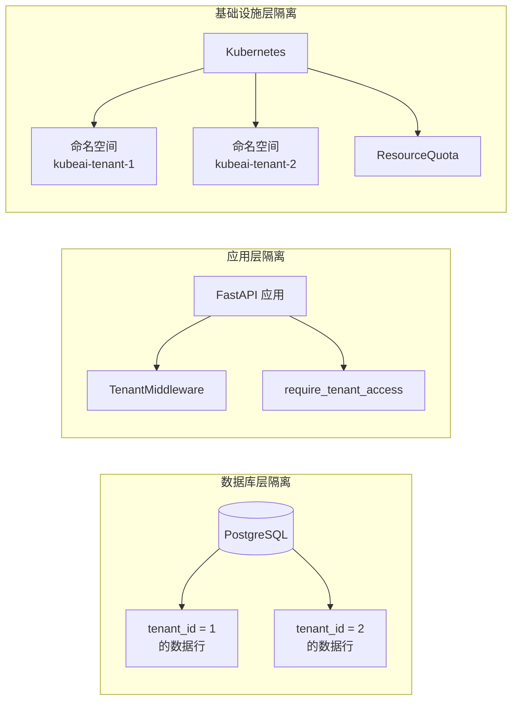
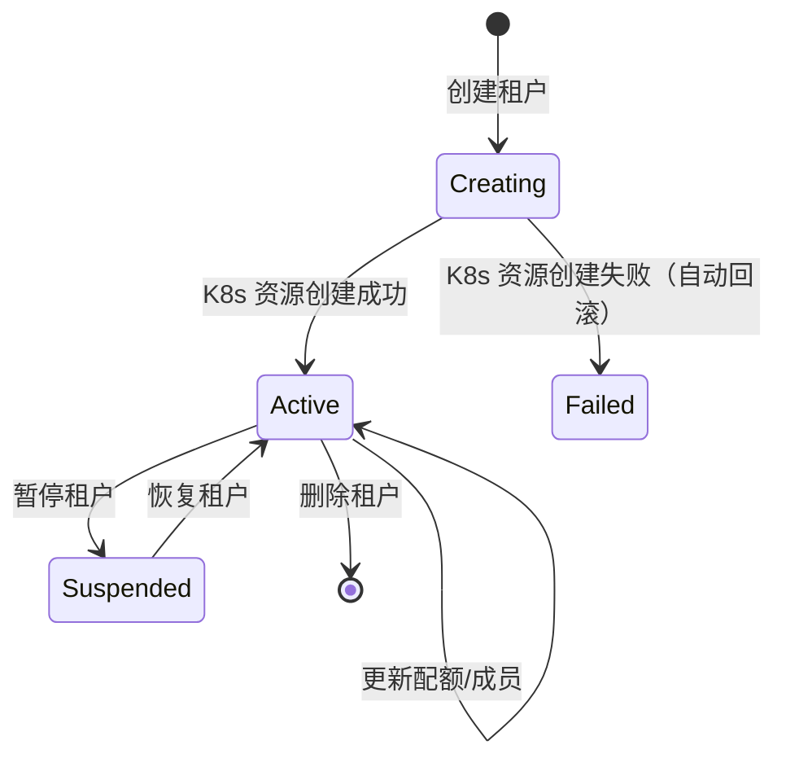

# 多租户设计

KubeAI 实现了三层多租户隔离，确保不同租户之间的数据和资源完全隔离。

## 隔离层次



## 1. 数据库层隔离

### TenantMixin

所有租户相关的数据模型继承 `TenantMixin`：

```python
class TenantMixin:
    tenant_id: Mapped[str] = mapped_column(
        String(36), ForeignKey("tenants.id"), nullable=False
    )
```

使用此 Mixin 的模型：Dataset、TrainingJob、InferenceService、AnnotationProject、DevEnvironment 等。

### 租户过滤

`utils/tenant_filter.py` 提供自动租户过滤，查询时自动添加 `WHERE tenant_id = :current_tenant_id` 条件。

## 2. 应用层隔离

### TenantMiddleware

`middleware/tenant.py` — 每个请求自动解析租户上下文：

1. 从 JWT Token 中提取用户信息
2. 根据用户当前活跃租户设置上下文
3. 将 `tenant_id` 注入到请求状态中

### require_tenant_access

`api/deps.py` 中的依赖注入函数：

```python
async def require_tenant_access(resource_tenant_id: str) -> None:
    """
    确保用户只能访问自己租户的资源。
    admin 角色可以访问所有租户的资源。
    """
```

## 3. 基础设施层隔离

### Kubernetes 命名空间

每个租户创建独立的 Kubernetes 命名空间，前缀为 `kubeai-`：

```
kubeai-default          # 默认租户
kubeai-team-alpha       # Alpha 团队租户
kubeai-team-beta        # Beta 团队租户
```

`TenantService` 创建租户时自动：

1. 创建 Kubernetes 命名空间
2. 创建 ResourceQuota（CPU、内存、GPU 限制）

失败时自动回滚已创建的资源。

### ResourceQuota

为每个租户命名空间设置资源配额：

```yaml
apiVersion: v1
kind: ResourceQuota
metadata:
  name: tenant-quota
  namespace: kubeai-team-alpha
spec:
  hard:
    requests.cpu: "16"
    requests.memory: 32Gi
    limits.nvidia.com/gpu: "4"
```

> **注**：平台曾通过 NetworkPolicy 做租户间网络隔离，为保证租户内负载（推理/训练/开发环境）可自由访问外部服务，现已移除网络层限制；命名空间级资源隔离由 ResourceQuota 保障，如后续有安全需求可再引入。

## 租户生命周期



## 租户成员管理

- 租户创建者自动成为租户管理员
- 通过 `InvitationService` 邀请用户加入租户
- 支持为成员分配不同的租户内角色
- admin 全局角色可以管理所有租户

## 配额管理

每个租户可配置以下资源配额：

| 资源 | 说明 |
|------|------|
| CPU | CPU 请求总量限制 |
| 内存 | 内存请求总量限制 |
| GPU | NVIDIA GPU 限制 |
| PVC | 持久化存储总量限制 |
| Pod 数量 | 最大并发 Pod 数 |

配额变更通过 `TenantService` 同步更新 Kubernetes ResourceQuota。

## 配额告警

`QuotaAlertService` 监控租户资源使用情况，当使用量接近阈值时触发告警通知。
