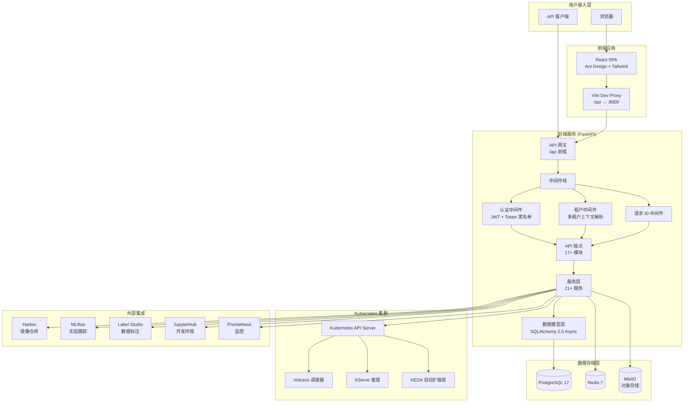
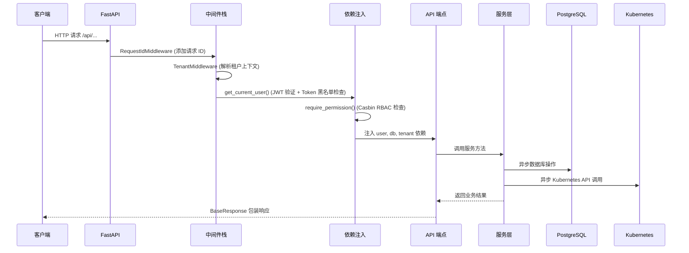

# 系统架构总览

## 架构图

## 核心架构分层

KubeAI 后端采用经典的分层架构：

### 1. API 层（端点层）

- 17+ API 端点模块，统一挂载在 `/api` 前缀下
- 负责请求校验（Pydantic Schema）、权限检查（依赖注入）、响应序列化
- 统一使用 `BaseResponse[T]` 包装响应格式：`{success, message, data}`

### 2. 服务层（业务逻辑层）

- 21+ 服务类，封装核心业务逻辑
- 构造器注入 `AsyncSession`（数据库）、`Redis`、`MinIO Client` 等依赖
- 同步外部客户端（MinIO、Harbor）通过 `asyncio.to_thread()` 包装为异步调用

### 3. 集成层（外部系统交互）

- `integrations/k8s/` — Kubernetes 异步客户端（namespace、job、PVC、secret 等）
- `integrations/volcano/` — Volcano VCJob 批处理调度
- `integrations/kserve/` — KServe 推理服务管理
- `integrations/keda/` — KEDA 自动扩缩容
- `integrations/minio/` — MinIO 对象存储
- `integrations/harbor/` — Harbor 镜像仓库
- `integrations/mlflow/` — MLflow 实验跟踪
- `integrations/labelstudio/` — Label Studio 数据标注
- `integrations/jupyterhub/` — JupyterHub 开发环境
- `integrations/prometheus/` — Prometheus 监控指标

### 4. 数据模型层

- SQLAlchemy 2.0 异步 ORM，使用 `Mapped` / `mapped_column` 声明式映射
- 公共 Mixin：`TimestampMixin`（创建/更新时间）、`TenantMixin`（租户 ID）、`SoftDeleteMixin`（软删除）
- 15+ 数据模型，覆盖所有业务实体

## 请求处理流程

一个典型的 API 请求处理流程：

## 技术选型理由

| 技术 | 选型理由 |
|------|----------|
| FastAPI | 原生异步支持、自动 OpenAPI 文档、Pydantic 校验 |
| async SQLAlchemy | 兼容 FastAPI 异步生态，2.0 版本提供类型安全的 ORM |
| Casbin | 灵活的策略引擎，支持 RBAC/ABAC 模型 |
| Volcano | Kubernetes 原生批处理调度器，支持排队、优先级、抢占 |
| KServe | Kubernetes 标准推理协议，支持多框架 |
| KEDA | 基于事件的 Kubernetes 自动扩缩容 |
| Zustand | 轻量级 React 状态管理，API 简洁 |
| TanStack Query | 服务端状态缓存，自动重试和失效 |
| Ant Design | 企业级 React UI 库，组件丰富 |
| MinIO | S3 兼容对象存储，私有化部署 |
