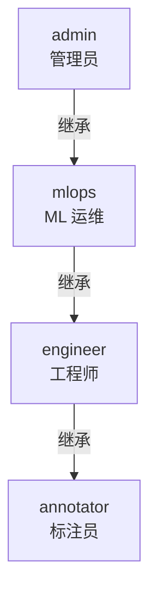

# RBAC 权限模型

KubeAI 使用 Casbin 实现 RBAC（基于角色的访问控制），提供精细化的权限管理。

## 角色层次



角色权限逐级继承，上级角色自动拥有下级角色的所有权限。

## 资源与操作

### 资源定义（16 类）

| 资源 | 标识 | 说明 |
|------|------|------|
| 用户管理 | `users` | 系统用户 CRUD |
| 租户管理 | `tenants` | 租户及配额管理 |
| 资源配额 | `quotas` | 租户资源配额 |
| 数据集 | `datasets` | 数据集和版本管理 |
| 数据标注 | `annotations` | 标注项目和任务 |
| 训练任务 | `training_jobs` | 模型训练任务 |
| 实验跟踪 | `experiments` | MLflow 实验管理 |
| 模型注册 | `models` | 注册模型和版本 |
| 推理服务 | `inference_services` | 模型推理部署 |
| 镜像管理 | `images` | 容器镜像构建 |
| 开发环境 | `dev_environments` | Jupyter 开发环境 |
| 环境镜像 | `dev_environment_images` | 开发环境镜像 |
| 监控 | `monitoring` | 集群监控和指标 |
| 审计日志 | `audit_logs` | 操作审计记录 |
| 通知 | `notifications` | 用户通知 |
| 仪表盘 | `dashboard` | 首页仪表盘 |

### 操作定义（4 类）

| 操作 | 标识 | 说明 |
|------|------|------|
| 读取 | `read` | 查看资源详情 |
| 写入 | `write` | 创建/更新资源 |
| 管理 | `manage` | 管理操作（包含 read + write + 其他管理操作） |
| 构建 | `build` | 构建操作（如构建镜像） |

## 权限矩阵

| 资源 | annotator | engineer | mlops | admin |
|------|-----------|----------|-------|-------|
| `dashboard` | :material-check: read | :material-check: read | :material-check: read | :material-check-all: manage |
| `datasets` | :material-check: read | :material-check: read | :material-check: write | :material-check-all: manage |
| `annotations` | :material-check: read/write | :material-check: read/write | :material-check-all: manage | :material-check-all: manage |
| `training_jobs` | - | :material-check: read/write | :material-check-all: manage | :material-check-all: manage |
| `experiments` | - | :material-check: read/write | :material-check-all: manage | :material-check-all: manage |
| `models` | - | :material-check: read | :material-check: write | :material-check-all: manage |
| `inference_services` | - | :material-check: read | :material-check-all: manage | :material-check-all: manage |
| `images` | - | :material-check: read + build | :material-check-all: manage | :material-check-all: manage |
| `dev_environments` | - | :material-check: read/write | :material-check-all: manage | :material-check-all: manage |
| `monitoring` | - | - | :material-check: read | :material-check-all: manage |
| `audit_logs` | - | - | :material-check: read | :material-check-all: manage |
| `users` | - | - | :material-check: read | :material-check-all: manage |
| `tenants` | - | - | - | :material-check-all: manage |
| `quotas` | - | - | - | :material-check-all: manage |
| `notifications` | :material-check: read/write | :material-check: read/write | :material-check: read/write | :material-check-all: manage |

## 实现机制

### Casbin 模型

`core/rbac_model.conf` 定义 RBAC 模型：

```ini
[request_definition]
r = sub, obj, act

[policy_definition]
p = sub, obj, act

[role_definition]
g = _, _

[policy_effect]
e = some(where (p.eft == allow))

[matchers]
m = g(r.sub, p.sub) && r.obj == p.obj && (r.act == p.act || p.act == "manage")
```

!!! note "manage 操作的特殊匹配"
    `manage` 操作在 matcher 中匹配所有操作。即如果策略中定义了 `manage`，则 `read`、`write` 等操作都会被允许。

### 策略存储

权限策略存储在 PostgreSQL 数据库中（通过 Casbin SQLAlchemy Adapter），应用启动时自动从 `permissions.py` 加载种子策略。

### 权限检查

权限检查通过 FastAPI 依赖注入实现：

```python
# 在 API 端点中使用
@router.post("/datasets")
async def create_dataset(
    data: DatasetCreate,
    user: CurrentUser,
    db: AsyncSession = Depends(get_db),
    _=Depends(require_permission("datasets", "write")),
):
    ...
```

### 前端权限控制

前端通过两种方式实现权限控制：

**路由级别**：使用 `PermissionGuard` 组件包裹路由

```tsx
<Route path="/admin/users" element={
  <PermissionGuard permission="users:manage">
    <UsersPage />
  </PermissionGuard>
} />
```

**组件级别**：根据权限条件渲染

```tsx
{hasPermission("training_jobs:write") && (
  <Button onClick={handleCreate}>创建训练任务</Button>
)}
```

admin 角色拥有通配符权限 `*`，自动通过所有权限检查。

## 审计日志

所有受权限控制的操作自动记录审计日志，包含：

- 操作者（用户 ID + 用户名）
- 操作类型（创建/读取/更新/删除）
- 资源类型和 ID
- 操作时间
- 请求详情
