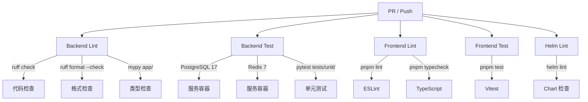
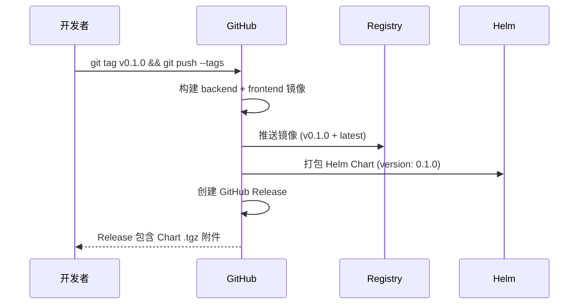

# CI/CD 流水线

KubeAI 使用 GitHub Actions 实现 CI/CD，包含三个工作流。

## CI 工作流（ci.yml）

**触发条件：** PR 和 Push 到 `main` / `dev` 分支

### 任务矩阵



所有任务并行执行，任一任务失败将阻止 PR 合并。

## 构建工作流（build.yml）

**触发条件：** Push 到 `main` / `dev` 分支，版本 Tag（`v*`）

### 构建流程

| 步骤 | 说明 |
|------|------|
| Checkout | 检出代码 |
| Docker Build | 多阶段构建 Docker 镜像 |
| Registry Login | 登录 GitHub Container Registry (ghcr.io) |
| Push | 推送镜像（commit SHA 标签 + latest） |

### 镜像命名

```
ghcr.io/<org>/backend:<sha>    # 后端镜像
ghcr.io/<org>/frontend:<sha>   # 前端镜像
```

镜像仅在 push 事件时推送（PR 仅构建不推送）。

## 发布工作流（release.yml）

**触发条件：** 版本 Tag（`v*`，如 `v0.1.0`）

### 发布流程



## 本地开发验证

在提交 PR 之前，建议本地运行检查：

```bash
# 后端
cd backend/
uv run ruff check .
uv run ruff format --check .
uv run mypy app/
uv run pytest tests/unit/

# 前端
cd frontend/
pnpm lint
pnpm typecheck
pnpm test

# Helm
helm lint infra/helm/kubeai/
```
