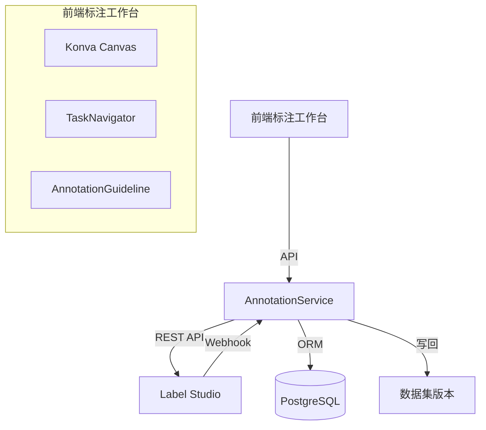
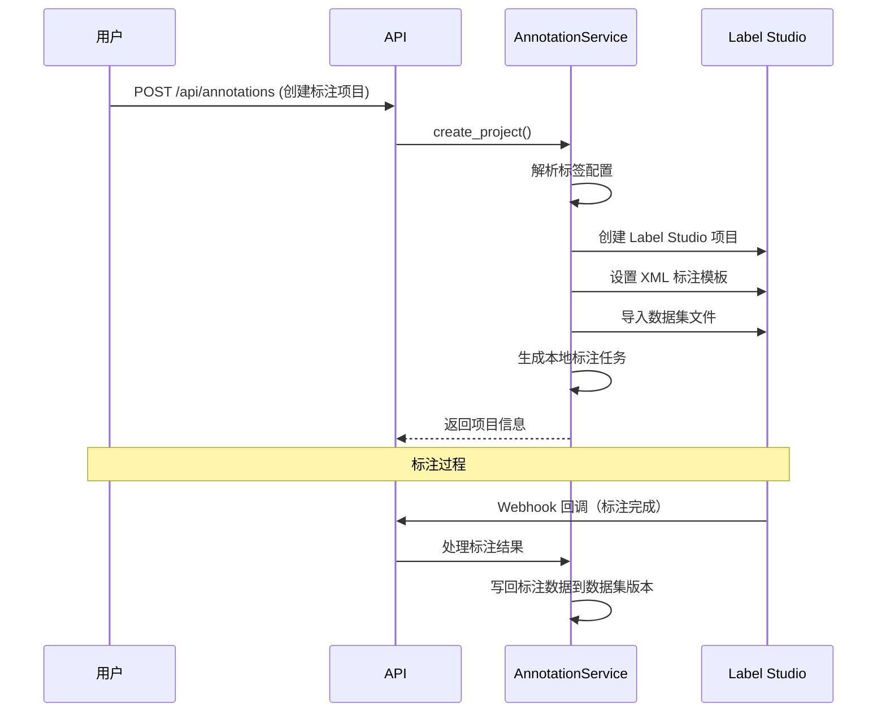

# 数据标注

## 概述

KubeAI 集成 Label Studio 提供数据标注功能，支持多种标注类型，包括图像分类、目标检测、语义分割和文本分类等。

## 核心概念

| 概念 | 说明 |
|------|------|
| AnnotationProject | 标注项目，关联数据集版本和标签配置 |
| AnnotationTask | 标注任务，分配给标注员的具体标注工作 |
| LabelConfig | 标签配置，定义标注类型和标签结构 |

## 标注类型

| 类型 | 组件 | 说明 |
|------|------|------|
| 图像分类 | `ImageClassificationAnnotator` | 对图像进行类别标注 |
| 目标检测 | `ObjectDetectionAnnotator` | 在图像上绘制矩形框 |
| 语义分割 | `ImageSegmentationAnnotator` | 像素级别的分割标注（Konva Canvas） |
| 文本分类 | `TextClassificationAnnotator` | 对文本进行分类标注 |
| 自定义选项 | `ChoicesAnnotator` | 自定义选项列表 |
| 文本输入 | `TextAreaAnnotator` | 自由文本输入标注 |

## 架构集成

### Label Studio 集成

- `integrations/labelstudio/client.py` — Label Studio REST API 客户端
- `integrations/labelstudio/templates.py` — XML 模板构建器

`templates.py` 为每种标注类型生成 Label Studio 兼容的 XML 配置。

## 标注项目创建流程

## 标注工作台

前端标注工作台（`pages/annotations/workspace.tsx`）是前端最复杂的模块：

- 基于 Konva 实现 Canvas 渲染
- 支持缩放、平移、撤销/重做
- 任务导航和进度追踪
- 标注指南显示
- 多标注类型切换

### 标注员视图

标注员可以：

1. 查看分配给自己的任务列表（`MyTaskList` 组件）
2. 在标注工作台完成标注
3. 提交或跳过任务
4. 查看标注指南

### 管理员视图

管理员可以：

1. 创建标注项目和配置标签（`CreateProjectModal`）
2. 分配标注任务给标注员（`TaskAssignModal`）
3. 监控标注进度
4. 导出标注结果

## 标注写回

标注员每次 submit 时，结果立即落盘：

- 原始 payload 写入 `AnnotationTask.result`（JSONB）。
- 包装后的 JSON（包含 task_id、annotation_project_id、annotation_type、submitted_at、submitted_by）写入源数据集版本的 `annotations/<源文件名>.json`，例如 `datasets/<tenant>/<dataset>/v1/annotations/a.jpg.json`。
- Label Studio 同步收到一份镜像。

数据集预览页对每个有标注的文件显示"已标注 / 查看"徽标。训练 pipeline 通过 hostPath 挂载直接读取 `annotations/<file>.json`，不需要额外的 API。

已完成标注的任务在"我的任务"或详情页中可点击"取消标注"回到 in_progress，删除 `annotations/<file>.json`，清空 `task.result`，已完成的 `project.completed_tasks` 同步递减。

## 相关 API

| 接口 | 方法 | 说明 |
|------|------|------|
| `/api/annotations` | GET | 列出标注项目 |
| `/api/annotations` | POST | 创建标注项目 |
| `/api/annotations/{id}` | GET | 获取项目详情 |
| `/api/annotations/{id}` | DELETE | 删除项目 |
| `/api/annotations/{id}/tasks` | GET | 列出标注任务 |
| `/api/annotations/{id}/tasks/{tid}/assign` | POST | 分配任务 |
| `/api/annotations/{id}/tasks/{tid}/submit` | POST | 提交标注结果（立即落盘到 `annotations/<file>.json`） |
| `/api/annotations/{id}/tasks/{tid}/cancel` | POST | 取消标注，回到 in_progress |
| `/api/datasets/{id}/versions/{vid}/files/{name}/annotation` | GET | 读单文件标注 JSON |
| `/api/annotations/{id}/export` | POST | 导出标注数据 |
