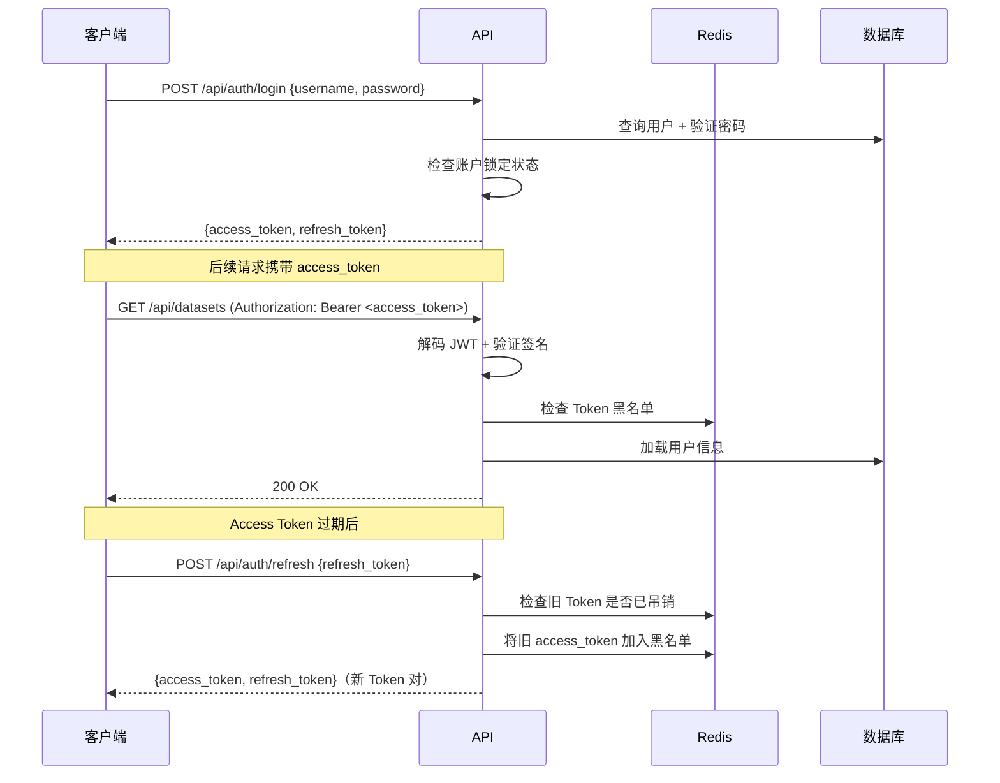

# 用户认证

## 认证方式

### JWT Token 认证（默认）

KubeAI 使用 JWT（HS256）进行用户认证，支持 Access Token 和 Refresh Token 双 Token 机制。

**认证流程：**

**Token 规格：**

| 参数 | Access Token | Refresh Token |
|------|-------------|---------------|
| 有效期 | 30 分钟 | 7 天 |
| 类型标识 | `type: "access"` | `type: "refresh"` |
| 存储 | 前端 localStorage + Zustand | 前端 localStorage + Zustand |
| 吊销 | Redis 黑名单（JTI） | Redis 黑名单（JTI） |

### OIDC/OAuth2 单点登录（可选）

支持通过 OIDC 协议对接外部身份提供商（如 Casdoor、Keycloak、Authing、Azure AD）。

**配置项：**

| 环境变量 | 说明 |
|----------|------|
| `OIDC_ENABLED` | 是否启用 OIDC |
| `OIDC_ISSUER` | OIDC 签发者 URL |
| `OIDC_CLIENT_ID` | 客户端 ID |
| `OIDC_CLIENT_SECRET` | 客户端密钥 |
| `OIDC_SCOPES` | OAuth 范围（默认 `openid profile email`） |
| `OIDC_DISPLAY_NAME` | 登录页显示名称 |
| `OIDC_AUTO_REDIRECT` | 是否自动跳转 SSO 登录页（默认 `false`） |

**SSO 登录流程：**

1. 用户点击登录页的 SSO 按钮
2. 重定向到身份提供商授权页面
3. 用户完成认证后回调到 `/auth/callback`
4. 后端用授权码换取用户信息
5. 自动创建/关联本地用户账号
6. 返回 JWT Token

### Casdoor 角色同步

对接 Casdoor 时，KubeAI 会在每次 OIDC 登录时自动同步用户角色。Casdoor 端的角色以 `kubeai_` 为前缀命名，映射关系如下：

| Casdoor 角色 | KubeAI 角色 |
|-------------|------------|
| `kubeai_admin` | 管理员 (admin) |
| `kubeai_mlops` | MLOps 工程师 (mlops) |
| `kubeai_engineer` | 算法工程师 (engineer) |
| `kubeai_annotator` | 标注员 (annotator) |

**配置要点：**

1. **Casdoor 端**：在 Casdoor 应用中为用户分配 `kubeai_` 前缀的角色即可，KubeAI 通过 `/api/get-account` 接口自动获取
2. **同步行为**：
   - 登录时如果 userinfo 中包含 `kubeai_` 前缀的角色，直接覆盖 KubeAI 用户角色
   - 用户拥有多个 `kubeai_` 角色时，取优先级最高者（admin > mlops > engineer > annotator）
   - 如果 userinfo 中没有 `kubeai_` 前缀的角色，不修改用户现有角色
   - 无效的角色名（如 `kubeai_superuser`）会被跳过并记录警告日志

## 账户安全

### 账户锁定

连续 5 次登录失败后锁定账户 15 分钟（基于 Redis TTL 计数）。

### Token 黑名单

用户登出时，将当前 Token 的 JTI 加入 Redis 黑名单，确保 Token 无法被重复使用。

### 密码安全

- 使用 bcrypt 进行密码哈希
- 哈希操作通过 `asyncio.to_thread()` 异步执行，避免阻塞事件循环

## API Token

支持创建 API Token（格式 `sk-<hex>`）用于程序化访问：

- SHA-256 哈希后存储在 Kubernetes Secret 中
- 不存储原始 Token 值，创建时仅显示一次
- 支持为不同用途创建多个 Token

## 相关 API

| 接口 | 方法 | 说明 |
|------|------|------|
| `/api/auth/register` | POST | 用户注册 |
| `/api/auth/login` | POST | 用户登录 |
| `/api/auth/refresh` | POST | 刷新 Token |
| `/api/auth/logout` | POST | 用户登出 |
| `/api/auth/me` | GET | 获取当前用户信息 |
| `/api/auth/oidc/{provider}` | GET | 发起 OIDC 登录 |
| `/api/auth/oidc/{provider}/callback` | GET | OIDC 回调 |
