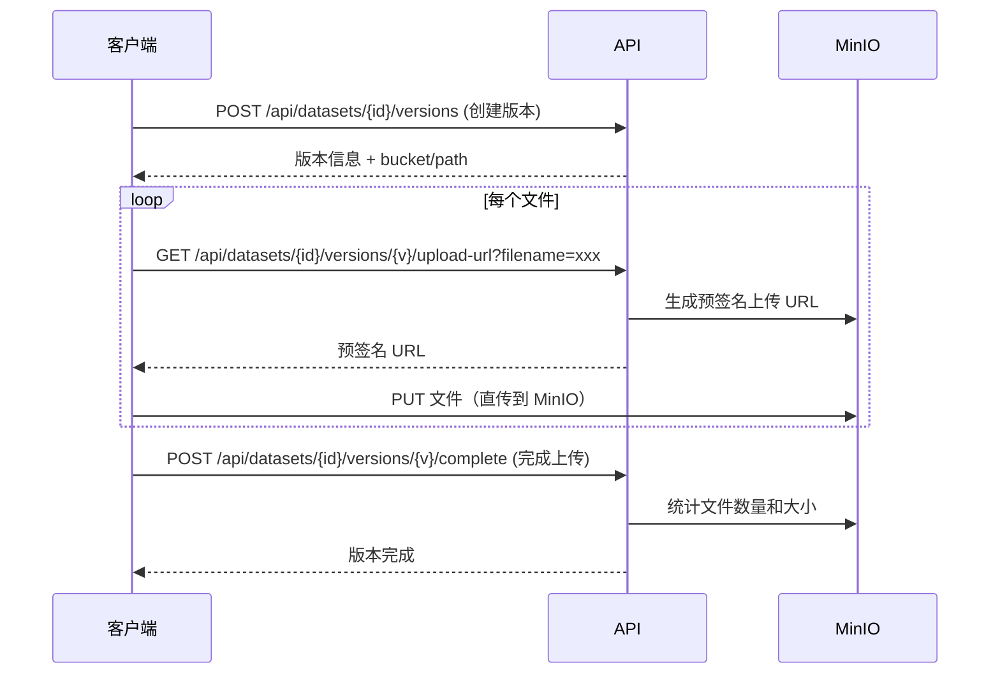

# 数据集管理

## 概述

KubeAI 的数据集管理功能基于 MinIO 对象存储，支持数据集的创建、版本管理、文件上传下载，以及与训练任务、标注项目的无缝集成。

## 核心概念

### 数据集（Dataset）

数据集是文件数据的逻辑集合，属于特定租户。每个数据集包含：

- 名称和描述
- 数据类型（图像、文本、音频等）
- 标签信息
- 多个版本

### 数据集版本（DatasetVersion）

数据集支持多版本管理，每个版本包含：

- 版本号
- 文件列表和存储路径
- 文件数量和总大小
- 创建者信息
- 标注状态

## 文件存储

所有文件存储在 MinIO 中，使用租户隔离的 bucket 命名：

```
kubeai-datasets-{tenant_id}/
├── {dataset_id}/
│   ├── v1/
│   │   ├── file1.jpg
│   │   ├── file2.jpg
│   │   └── ...
│   └── v2/
│       └── ...
```

### 文件上传流程



使用预签名 URL 实现客户端直传 MinIO，避免文件通过后端中转，提高上传效率。

## 数据集与训练任务

训练任务可以挂载数据集版本作为数据输入：

1. 创建训练任务时指定数据集版本
2. `TrainingJobService` 自动创建 PVC 挂载到训练 Pod
3. 数据通过 MinIO CSI 或 init-container 预加载到训练容器

## 数据集与标注项目

数据集版本可以直接创建标注项目：

1. 选择数据集版本作为标注数据源
2. `AnnotationService` 将文件导入 Label Studio 项目
3. 标注完成后将结果写回数据集版本

## 相关 API

| 接口 | 方法 | 说明 |
|------|------|------|
| `/api/datasets` | GET | 列出数据集 |
| `/api/datasets` | POST | 创建数据集 |
| `/api/datasets/{id}` | GET | 获取数据集详情 |
| `/api/datasets/{id}` | PUT | 更新数据集 |
| `/api/datasets/{id}` | DELETE | 删除数据集 |
| `/api/datasets/{id}/versions` | GET | 列出版本 |
| `/api/datasets/{id}/versions` | POST | 创建版本 |
| `/api/datasets/{id}/versions/{v}/upload-url` | GET | 获取上传预签名 URL |
| `/api/datasets/{id}/versions/{v}/download-url` | GET | 获取下载预签名 URL |
| `/api/datasets/{id}/versions/{v}/complete` | POST | 完成版本上传 |
