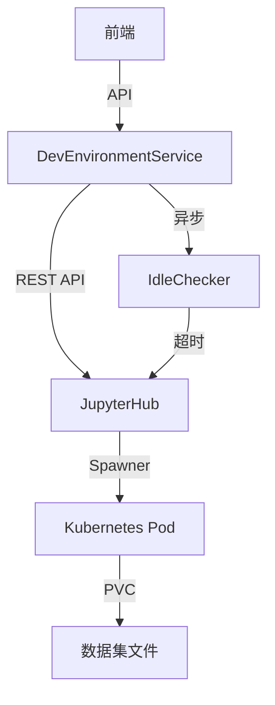
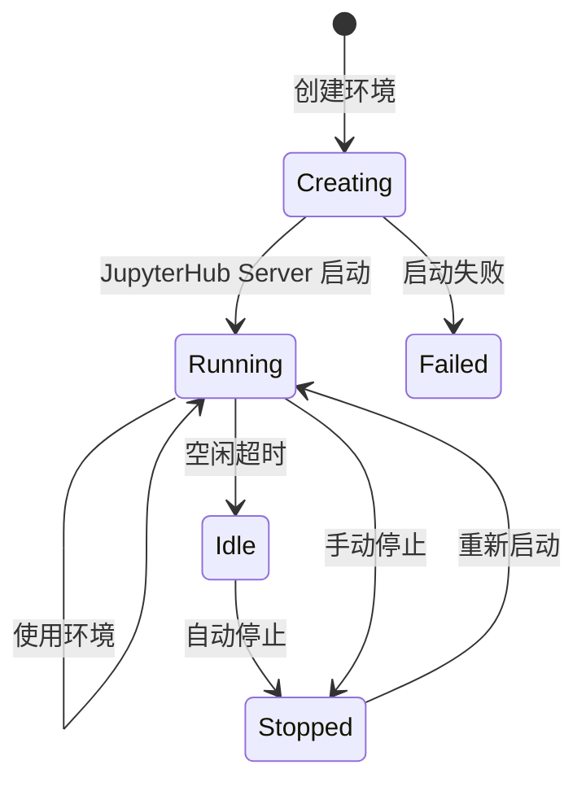

# 开发环境

## 概述

KubeAI 集成 JupyterHub 为用户提供交互式开发环境，支持 Jupyter Notebook、VS Code 和 RStudio，可挂载数据集进行数据探索和模型开发。

## 核心概念

| 概念 | 说明 |
|------|------|
| DevEnvironment | 开发环境实例，对应一个 JupyterHub 用户服务器 |
| DevEnvironmentImage | 开发环境镜像（预置和自定义） |
| IdleChecker | 后台空闲检测服务，自动停止空闲环境 |

## 架构集成

### JupyterHub 集成

- `integrations/jupyterhub/client.py` — JupyterHub REST API 客户端
- `integrations/jupyterhub/rbac.py` — JupyterHub RBAC 权限集成

## 开发环境类型

支持多种开发环境镜像：

| 类型 | 镜像 | 说明 |
|------|------|------|
| Jupyter (PyTorch) | `jupyter/datascience-notebook` + PyTorch | PyTorch 开发 |
| Jupyter (TensorFlow) | `jupyter/datascience-notebook` + TensorFlow | TensorFlow 开发 |
| Jupyter (SciPy) | `jupyter/datascience-notebook` | 通用科学计算 |
| VS Code | VS Code Server | 在线 VS Code 编辑器 |
| RStudio | RStudio Server | R 语言开发环境 |

## 环境生命周期

## 数据集挂载

开发环境支持挂载数据集版本：

1. 用户选择要挂载的数据集版本
2. 系统创建 PVC 并预加载数据
3. 环境启动时通过 Volume Mount 将数据集挂载到指定目录
4. 用户可以在 Notebook 中直接读取数据集文件

## 空闲自动停止

`IdleChecker` 后台任务定期检测开发环境活跃状态：

| 配置项 | 默认值 | 说明 |
|--------|--------|------|
| `IDLE_TIMEOUT_MINUTES` | 30 | 空闲超时时间（分钟） |
| 检测间隔 | 60 秒 | 检测频率 |

检测逻辑：

1. 通过 JupyterHub API 检查最近活动时间
2. 超过空闲阈值的环境标记为 Idle
3. 自动停止 Idle 环境，释放资源
4. 通过 WebSocket 通知用户

## 从环境创建训练任务

开发环境支持将 Notebook 直接转化为训练任务：

1. 用户在 Notebook 中完成实验代码
2. 选择 "提交为训练任务"
3. 系统自动提取代码和依赖
4. 创建训练任务并在集群上运行

## JupyterHub 认证

开发环境使用自定义 `KubeAIForcedLoginAuthenticator`：

- 通过 API Token 自动认证用户身份
- 无需在 JupyterHub 登录页再次输入密码
- 支持基于 KubeAI 角色的 RBAC 控制

## 相关 API

| 接口 | 方法 | 说明 |
|------|------|------|
| `/api/dev-environments` | GET | 列出开发环境 |
| `/api/dev-environments` | POST | 创建开发环境 |
| `/api/dev-environments/{id}` | GET | 获取环境详情 |
| `/api/dev-environments/{id}` | DELETE | 删除环境 |
| `/api/dev-environments/{id}/start` | POST | 启动环境 |
| `/api/dev-environments/{id}/stop` | POST | 停止环境 |
| `/api/dev-environment-images` | GET | 列出可用镜像 |
