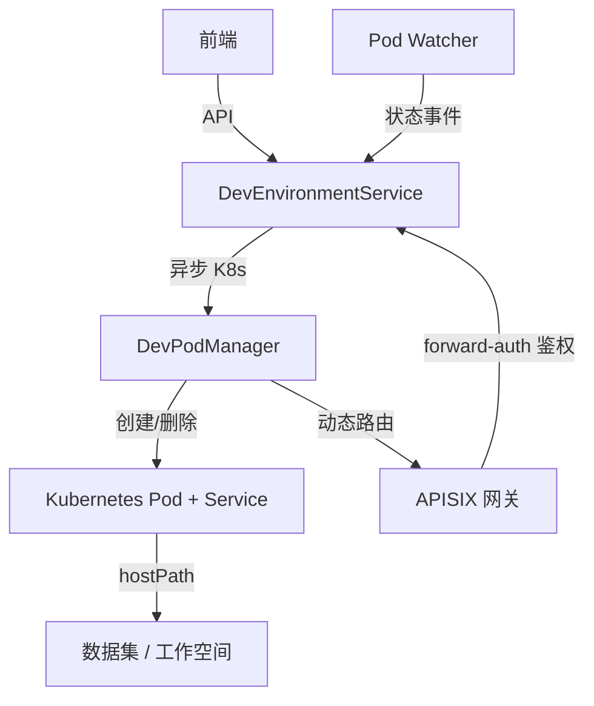
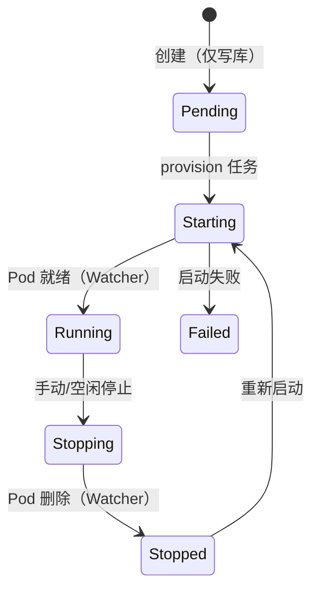

# 开发环境

## 概述

KubeAI 为用户提供交互式开发环境（Jupyter Notebook、VS Code、RStudio），直接以**原生 Kubernetes Pod** 形式运行，并通过 **APISIX 路由网关**按路径前缀对外暴露。可挂载数据集进行数据探索和模型开发，空闲超时自动停止以释放资源。

不依赖外部开发环境调度器、不需要子域名或 DNS 通配符——单一域名，路径前缀 `/devenv/<env_id_hex>/` 路由。

## 核心概念

| 概念 | 说明 |
|------|------|
| DevEnvironment | 开发环境实例，对应一个原生 K8s Pod（资源名 `devenv-<env_id_hex>`，固定端口 8888） |
| DevEnvironmentImage | 开发环境镜像（预置和自定义） |
| DevPodManager | Pod + Service + APISIX 路由的生命周期管理（`integrations/k8s/dev_pod.py`） |
| Pod Watcher | 全局 K8s Pod Watch，事件驱动同步 STARTING→RUNNING/FAILED、STOPPING→STOPPED |

架构细节见 [开发环境原生 Pod 架构](../architecture/dev-environment-native-pod.md)。

## 架构集成

### 关键模块

- `integrations/k8s/dev_pod.py` — 构建原生 Pod/Service、通过 APISIX Admin API 动态下发/删除路由
- `integrations/k8s/dev_pod_watcher.py` — 订阅 Pod 事件，事件驱动状态转移
- `services/dev_environment_service.py` — 生命周期服务层（create/provision/start/stop/delete）
- `services/idle_checker.py` — 空闲检测（直接读 Pod 活跃时间）
- `api/endpoints/dev_environments.py` — REST 端点 + `/auth-check`（APISIX forward-auth 回调）

## 开发环境类型

支持多种开发环境镜像：

| 类型 | 说明 |
|------|------|
| Jupyter (PyTorch / TensorFlow / SciPy) | JupyterLab 交互式 Notebook |
| VS Code | 在线 VS Code 编辑器（code-server） |
| RStudio | R 语言开发环境 |

按 `environment_type` 由原生 entrypoint 启动对应服务（`jupyter lab` / `code-server` / `rserver`），APISIX 按类型决定是否剥除路径前缀。

## 环境生命周期

状态转移由全局 Pod Watcher 的事件驱动，亚秒级延迟，无需轮询。

## 数据集挂载

开发环境通过 **hostPath 卷**挂载工作空间、用户 Home 和数据集版本：

1. 用户选择要挂载的数据集版本
2. 环境创建时解析为持久化的 `mounted_datasets` 元数据（dataset/version/host_path/mount_path）
3. Pod 启动时按元数据重建卷与挂载点（`/kubeai/workspace`、`/kubeai/home`、`/kubeai/datasets/<name>/v<n>`）
4. 数据集卷以只读方式挂载

## 空闲自动停止

后台空闲检测任务定期读取 Pod 的最近活跃时间：

| 配置项 | 默认值 | 说明 |
|--------|--------|------|
| `DEV_ENV_IDLE_TIMEOUT_MINUTES` | 60 | 空闲超时时间（分钟） |
| `DEV_ENV_IDLE_CHECK_INTERVAL_SECONDS` | 300 | 检测间隔（秒） |

超过空闲阈值的环境被停止（Pod 删除，保留 Service/路由以便重启），并通过 WebSocket 通知用户。

## 访问与鉴权

- 访问地址由 `dev_access_url(env.id)` 派生：`{FRONTEND_URL host}/devenv/<hex>/`
- APISIX `forward-auth` 插件将请求回调后端 `/api/dev-environments/auth-check` 校验 KubeAI 会话
- 无需在开发环境内单独登录，鉴权复用 KubeAI 主应用

## 相关 API

| 接口 | 方法 | 说明 |
|------|------|------|
| `/api/dev-environments` | GET | 列出开发环境 |
| `/api/dev-environments` | POST | 创建开发环境 |
| `/api/dev-environments/{id}` | GET | 获取环境详情 |
| `/api/dev-environments/{id}` | DELETE | 删除环境 |
| `/api/dev-environments/{id}/start` | POST | 启动环境 |
| `/api/dev-environments/{id}/stop` | POST | 停止环境 |
| `/api/dev-environment-images` | GET | 列出可用镜像 |
