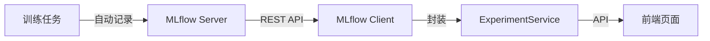
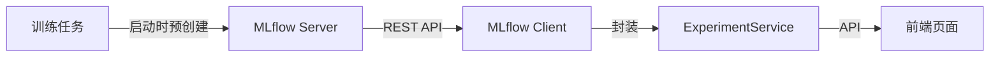

# 实验跟踪

## 概述

KubeAI 集成 MLflow 提供实验跟踪功能，支持记录训练参数、指标和产出物，以及实验对比和复现。

## 核心概念

| 概念 | 说明 |
|------|------|
| Experiment | 实验，关联到训练任务 |
| Run | 实验运行，记录一次训练的具体参数和指标 |
| Metric | 指标，如 accuracy、loss 等 |
| Artifact | 产出物，如模型文件、图表等 |

## 架构集成



- `integrations/mlflow/client.py` — MLflow REST API 客户端（基于 httpx）
- `services/experiment_service.py` — 业务逻辑封装
- 同步 MLflow 调用通过 `asyncio.to_thread()` 包装为异步

## 功能特性

### 实验记录

训练任务运行时自动记录：

- **参数**：学习率、batch size、epoch 数等
- **指标**：accuracy、loss、F1 score 等（支持时序记录）
- **产出物**：模型文件、训练日志、配置文件
- **环境信息**：Python 版本、依赖包列表

### 实验对比

支持选择多个实验进行横向对比：

- 参数对比表格
- 指标趋势图
- 产出物对比

前端使用 `ExperimentCompareDrawer` 组件实现对比功能。

### 实验复现

支持将实验直接复现为新的训练任务：

1. 从实验中提取参数和配置
2. 自动创建新的训练任务
3. 预填充实验的参数值

## 实验运行机制

MLflow 绑定是训练任务的属性，不是平台默认行为。创建训练任务时表单**默认不勾选** "实验追踪 (MLflow)"，需要指标追踪的任务手动开启。

- **勾选**：平台在提交 VCJob 之前预创建 MLflow **Experiment + Run**（experiment 幂等创建，每次提交新建一个 run），把 `mlflow_experiment_id` / `mlflow_run_id` 持久化到本地 `experiments` 表，并把 `MLFLOW_RUN_ID` 注入训练容器环境变量。训练脚本**必须** `mlflow.start_run(run_id=os.environ["MLFLOW_RUN_ID"])` 恢复该 run，再用 `mlflow.log_*()` 写入数据 —— 这是 job↔run 的**强绑定契约**。Volcano 自动重试时 env 不变，脚本 resume 同一个 run，不再产生多个 run。平台读取指标时直接用落库的 `mlflow_run_id` 调 `get_run`，不做 search 兜底。
- **未勾选 (默认)**：训练任务正常提交与运行，**不创建 Experiment 记录**，不会出现在 `/experiments` 页面。

> **脚本契约（重要）**：训练脚本若不读取 `MLFLOW_RUN_ID` 而自行 `start_run()`，会写到另一个 run，平台绑定的预创建 run 为空，详情页指标/超参将为空。创建表单与详情页均给出提示，平台不做向后兼容兜底。

脚本规范写法：

```python
import os
import mlflow

mlflow.set_tracking_uri(os.environ["MLFLOW_TRACKING_URI"])
mlflow.set_experiment(os.environ["MLFLOW_EXPERIMENT_NAME"])
# 恢复平台预创建的 run —— 强绑定，Volcano 重试共享同一 run
run_id = os.environ.get("MLFLOW_RUN_ID")
with mlflow.start_run(run_id=run_id) if run_id else mlflow.start_run():
    mlflow.log_params({"lr": 0.001})
    mlflow.log_metrics({"loss": 0.3}, step=epoch)
```

## MLflow UI 直链

详情页右上角"在 MLflow UI 中查看"按钮跳转原生 MLflow UI，可看 artifact 列表、模型注册表、完整 run 元数据。生产访问 `/mlflow`，依赖 APISIX forward-auth 鉴权。

## MLflow 配置

| 环境变量 | 说明 | 默认值 |
|----------|------|--------|
| `MLFLOW_TRACKING_URI` | MLflow 服务器地址 | `http://mlflow.kubeai.svc.cluster.local:5000` (生产), `http://localhost:5000` (本地) |
| `MLFLOW_EXPERIMENT_NAME` | 平台预建的 experiment 名 | `kubeai-{租户前8位}-{任务名}` |
| `MLFLOW_RUN_ID` | 平台预建 run 的 id，脚本须 `mlflow.start_run(run_id=...)` 恢复 | 平台提交时生成 |

平台启动时 (`init_clients()`) 会调用 `GET /health` 做健康检查，不可达降级为 warning（不阻塞后端启动）；勾选了实验追踪的任务在提交时若 MLflow 不可达会单独失败。

## 相关 API

| 接口 | 方法 | 说明 |
|------|------|------|
| `/api/experiments` | GET | 列出实验 |
| `/api/experiments/{id}` | GET | 获取实验详情 |
| `/api/experiments/{id}/metrics/{key}/history` | GET | 获取指标历史 |
| `/api/experiments/compare` | POST | 对比多个实验 |

实验复现：详情页"复现实验"按钮跳转到 `/training-jobs/create?from_experiment={id}`，表单预填超参、镜像、命令等。

## 架构集成



- `integrations/mlflow/client.py` — MLflow REST API 客户端（基于 httpx），含 search_experiments/search_runs/get_run/get_metric_history (读) + get_or_create_experiment/create_experiment (写)
- `services/experiment_service.py` — 业务逻辑封装
- 同步 MLflow 调用通过 `asyncio.to_thread()` 包装为异步
