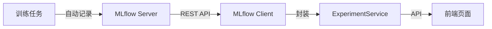

# 实验跟踪

## 概述

KubeAI 集成 MLflow 提供实验跟踪功能，支持记录训练参数、指标和产出物，以及实验对比和复现。

## 核心概念

| 概念 | 说明 |
|------|------|
| Experiment | 实验，关联到训练任务 |
| Run | 实验运行，记录一次训练的具体参数和指标 |
| Metric | 指标，如 accuracy、loss 等 |
| Artifact | 产出物，如模型文件、图表等 |

## 架构集成

- `integrations/mlflow/client.py` — MLflow REST API 客户端（基于 httpx）
- `services/experiment_service.py` — 业务逻辑封装
- 同步 MLflow 调用通过 `asyncio.to_thread()` 包装为异步

## 功能特性

### 实验记录

训练任务运行时自动记录：

- **参数**：学习率、batch size、epoch 数等
- **指标**：accuracy、loss、F1 score 等（支持时序记录）
- **产出物**：模型文件、训练日志、配置文件
- **环境信息**：Python 版本、依赖包列表

### 实验对比

支持选择多个实验进行横向对比：

- 参数对比表格
- 指标趋势图
- 产出物对比

前端使用 `ExperimentCompareDrawer` 组件实现对比功能。

### 实验复现

支持将实验直接复现为新的训练任务：

1. 从实验中提取参数和配置
2. 自动创建新的训练任务
3. 预填充实验的参数值

## MLflow 配置

| 环境变量 | 说明 | 默认值 |
|----------|------|--------|
| `MLFLOW_TRACKING_URI` | MLflow 服务器地址 | `http://localhost:30500` |
| `MLFLOW_ENABLED` | 是否启用实验跟踪 | `true` |

## 相关 API

| 接口 | 方法 | 说明 |
|------|------|------|
| `/api/experiments` | GET | 列出实验 |
| `/api/experiments/{id}` | GET | 获取实验详情 |
| `/api/experiments/{id}/runs` | GET | 列出实验运行 |
| `/api/experiments/{id}/reproduce` | POST | 复现实验为训练任务 |
| `/api/experiments/compare` | POST | 对比多个实验 |
