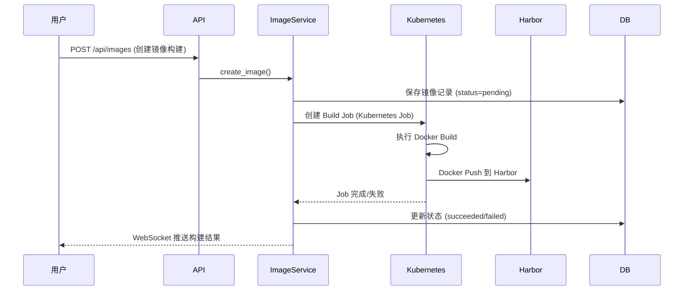
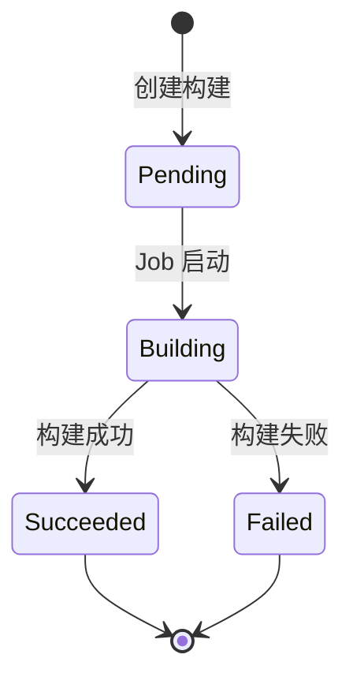

# 镜像管理

## 概述

KubeAI 提供容器镜像管理功能，支持预设镜像和自定义镜像构建，构建完成后自动推送到 Harbor 镜像仓库。

## 预设镜像

系统内置多种预设镜像，按用途分类：

### 训练镜像

| 镜像 | 说明 |
|------|------|
| PyTorch + CUDA | PyTorch 深度学习训练 |
| TensorFlow + CUDA | TensorFlow 深度学习训练 |
| MPI | MPI 分布式训练 |

### 开发环境镜像

| 镜像 | 说明 |
|------|------|
| Jupyter PyTorch | PyTorch 开发环境 |
| Jupyter SciPy | 科学计算环境 |
| Jupyter TensorFlow | TensorFlow 开发环境 |
| VS Code Base | 基础 VS Code 环境 |
| VS Code PyTorch | PyTorch + VS Code |
| RStudio ML | R 语言机器学习环境 |
| RStudio Verse | R 语言完整环境 |

镜像 Dockerfile 位于 `infra/images/` 目录下。

## 自定义镜像构建

### 构建流程

### 构建配置

自定义镜像构建支持：

| 配置项 | 说明 |
|--------|------|
| 基础镜像 | 构建的基础镜像 |
| Dockerfile | 自定义 Dockerfile 内容 |
| 构建参数 | Docker build args |
| 目标仓库 | Harbor 项目和镜像名 |
| 资源限制 | 构建任务的 CPU/内存限制 |

### Harbor 集成

- `integrations/harbor/client.py` — Harbor REST API 客户端
- 自动管理 Harbor 项目（`kubeai-` 前缀）
- 支持创建 Robot Account 用于推送镜像
- 镜像仓库 URL 使用 `HARBOR_URL` 配置

## 构建状态

## 相关 API

| 接口 | 方法 | 说明 |
|------|------|------|
| `/api/images` | GET | 列出镜像 |
| `/api/images` | POST | 创建镜像构建 |
| `/api/images/{id}` | GET | 获取镜像详情 |
| `/api/images/{id}` | DELETE | 删除镜像 |
| `/api/images/{id}/logs` | GET | 获取构建日志 |
