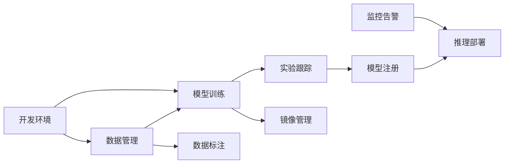

# 功能模块

KubeAI 提供完整的 AI/ML 全生命周期管理功能，涵盖从数据准备到模型部署的各个环节。

## 功能概览

## 模块列表

| 模块 | 说明 | 文档 |
|------|------|------|
| 用户认证 | JWT 认证、OIDC/SSO、账户锁定 | [详细文档](authentication.md) |
| 数据集管理 | MinIO 存储、版本管理、预签名上传 | [详细文档](datasets.md) |
| 训练任务 | Volcano 调度、GPU 管理、实时日志 | [详细文档](training-jobs.md) |
| 模型注册与推理 | 模型版本管理、KServe 推理、金丝雀发布 | [详细文档](model-inference.md) |
| 实验跟踪 | MLflow 集成、实验对比、复现实验 | [详细文档](experiments.md) |
| 数据标注 | Label Studio 集成、多类型标注、任务分配 | [详细文档](annotations.md) |
| 开发环境 | 原生 Pod、数据集挂载、空闲停止 | [详细文档](dev-environments.md) |
| 镜像管理 | 自定义镜像构建、Harbor 推送 | [详细文档](images.md) |
| 监控告警 | Prometheus 监控、GPU 指标、配额管理 | [详细文档](monitoring.md) |
