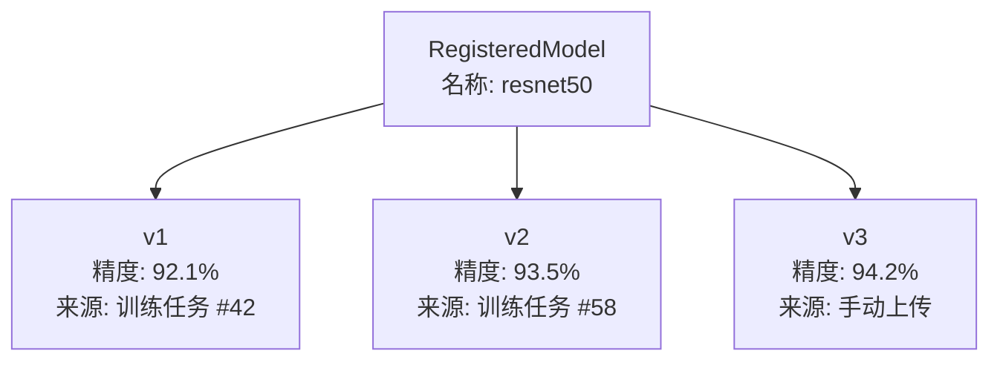
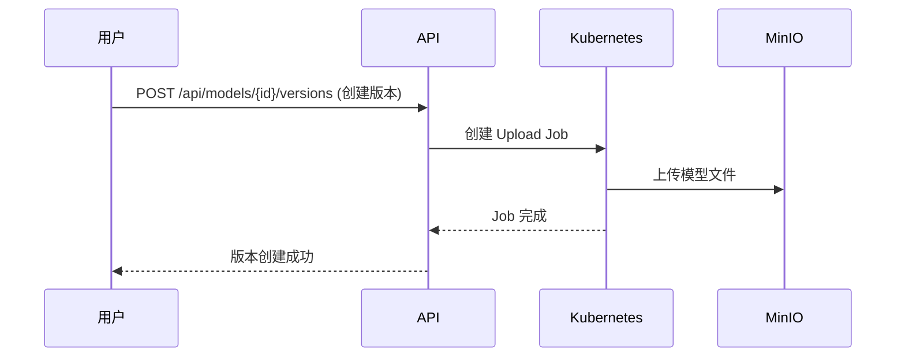
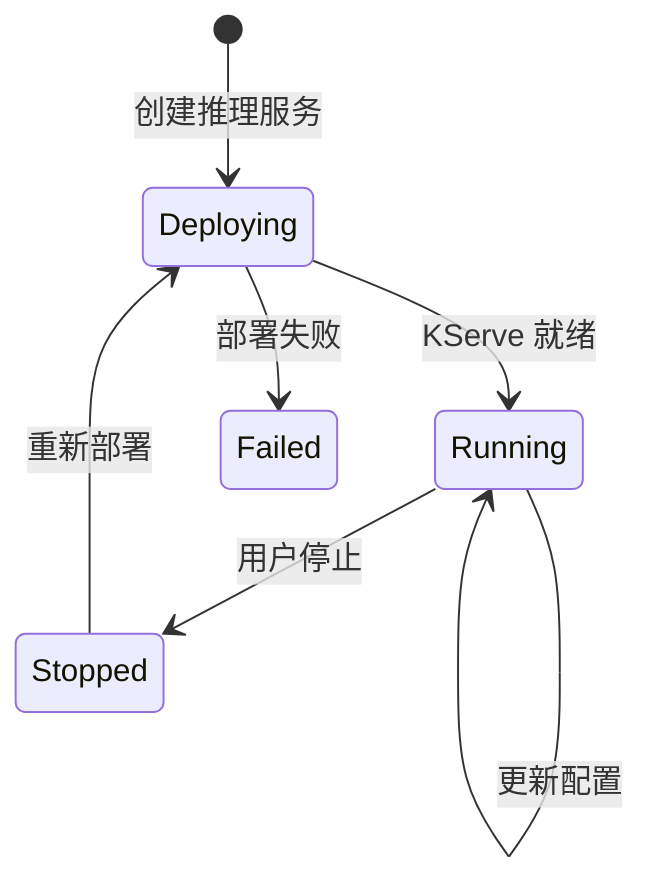

# 模型注册与推理

## 概述

KubeAI 提供模型注册中心（Model Registry）和推理服务部署（Inference Service）两大功能，实现从模型训练到线上推理的完整闭环。

## 模型注册中心

### 核心概念

| 概念 | 说明 |
|------|------|
| RegisteredModel | 注册模型，代表一个逻辑模型（如 ResNet50、BERT） |
| ModelVersion | 模型版本，每个注册模型可以有多个版本 |

### 模型来源

- **训练产出**：训练任务完成后自动注册模型版本
- **手动上传**：通过 K8s Upload Job 上传模型文件到 MinIO

### 模型版本管理



### 模型上传流程



## 推理服务

### 概述

推理服务基于 KServe，在 Kubernetes 上部署模型推理端点，支持：

- 多框架推理（PyTorch、TensorFlow、ONNX 等）
- 自动扩缩容（基于 KEDA）
- 金丝雀发布
- API Token 认证
- 自定义容器部署模式

### 推理服务状态



### KServe 集成

`integrations/kserve/` 提供推理服务的完整管理：

| 模块 | 功能 |
|------|------|
| `builder.py` | Builder 模式构建 InferenceService CRD |
| `client.py` | 异步 CRUD 操作 |
| `canary.py` | 金丝雀发布管理 |

### KEDA 自动扩缩容

`integrations/keda/` 提供基于请求量的自动扩缩容：

| 模块 | 功能 |
|------|------|
| `builder.py` | 构建 ScaledObject CRD |
| `client.py` | 异步扩缩容策略管理 |

配置示例：

```yaml
# KEDA ScaledObject
minReplicaCount: 1
maxReplicaCount: 10
triggers:
  - type: prometheus
    metadata:
      threshold: "100"
      query: sum(rate(http_requests_total{service="my-model"}[1m]))
```

### 金丝雀发布

支持将流量按比例分配到新旧版本：

```yaml
# 金丝雀发布配置
canary:
  trafficPercent: 20    # 20% 流量到新版本
  newRevision: "v3"
  stableRevision: "v2"
```

### 推理代理

`/api/inference-proxy/{service_name}` 端点代理请求到推理服务，支持：

- API Token 认证
- 请求路由到正确的 KServe 端点
- 跨命名空间代理

## 自定义容器部署

推理服务支持自定义容器部署模式，允许用户指定：

- 自定义推理镜像
- 环境变量
- 命令和参数
- 存储挂载

## 相关 API

### 模型注册

| 接口 | 方法 | 说明 |
|------|------|------|
| `/api/models` | GET | 列出注册模型 |
| `/api/models` | POST | 注册模型 |
| `/api/models/{id}` | GET | 获取模型详情 |
| `/api/models/{id}/versions` | GET | 列出模型版本 |
| `/api/models/{id}/versions` | POST | 创建模型版本 |

### 推理服务

| 接口 | 方法 | 说明 |
|------|------|------|
| `/api/inference-services` | GET | 列出推理服务 |
| `/api/inference-services` | POST | 创建推理服务 |
| `/api/inference-services/{id}` | GET | 获取服务详情 |
| `/api/inference-services/{id}` | PUT | 更新服务配置 |
| `/api/inference-services/{id}` | DELETE | 删除服务 |
| `/api/inference-services/{id}/stop` | POST | 停止服务 |
| `/api/inference-services/{id}/scale` | POST | 手动扩缩容 |
| `/api/inference-proxy/{service}` | POST | 推理代理 |
