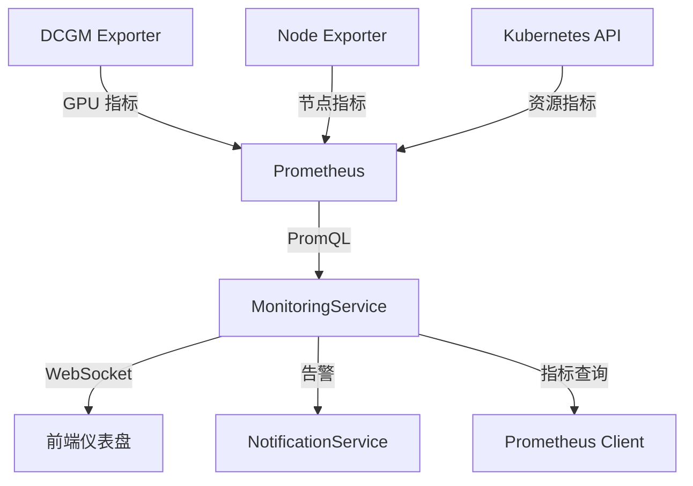

# 监控告警

## 概述

KubeAI 集成 Prometheus 提供集群监控功能，支持节点资源监控、GPU 指标采集、租户配额管理和资源告警。

## 架构

### Prometheus 集成

- `integrations/prometheus/client.py` — Prometheus HTTP API 客户端
- 使用 PromQL 查询指标数据
- 支持 HTTP Basic Auth 认证

### DCGM Exporter

- 采集 NVIDIA GPU 指标（利用率、显存、温度、功耗）
- 每 15 秒采集一次
- 自动容忍 GPU 节点的污点（Toleration）

## 监控指标

### 集群概览

| 指标 | 说明 |
|------|------|
| 节点数量 | 集群中活跃节点数 |
| CPU 使用率 | 集群整体 CPU 使用率 |
| 内存使用率 | 集群整体内存使用率 |
| GPU 使用率 | 集群整体 GPU 使用率 |
| 运行中的 Pod | 当前活跃 Pod 数量 |

### 节点资源

| 指标 | 说明 |
|------|------|
| 节点 CPU | 每个节点的 CPU 使用情况 |
| 节点内存 | 每个节点的内存使用情况 |
| 节点 GPU | 每个节点的 GPU 使用情况 |
| 节点状态 | 节点就绪状态 |

### 租户资源

| 指标 | 说明 |
|------|------|
| 配额分配 | 各租户的资源配额分配 |
| 实际使用 | 各租户的资源实际使用量 |
| 使用率 | 配额使用百分比 |
| 过期任务 | 各租户的过期任务统计 |

### GPU 详细指标

| 指标 | 说明 |
|------|------|
| GPU 利用率 | 每张 GPU 的计算利用率 |
| 显存使用 | GPU 显存使用量/总量 |
| GPU 温度 | GPU 核心温度 |
| GPU 功耗 | GPU 当前功耗 |
| GPU 利用进程 | 使用 GPU 的进程信息 |

## 实时推送

监控指标通过 WebSocket 实时推送到前端：

- `ws_manager.py` — WebSocket 连接管理器
- `ws_pubsub.py` — 基于 Redis 的跨进程发布/订阅
- 每 30 秒推送一次集群指标
- 支持按租户过滤指标数据

## 配额管理

### 配额分配

每个租户可配置：

- CPU 配额（核心数）
- 内存配额（GB）
- GPU 配额（卡数）
- 存储配额（GB）

### 配额使用追踪

`MonitoringService` 实时追踪各租户的资源使用情况：

- 统计租户命名空间中的 Pod 资源请求
- 对比配额限制计算使用率
- 支持配额转移（`QuotaTransferModal`）

### 配额告警

`QuotaAlertService` 监控配额使用情况：

- 使用率超过 80% 时触发警告
- 使用率超过 95% 时触发严重告警
- 告警通过通知系统推送给租户管理员

## 前端监控页面

### 监控仪表盘

前端监控页面（`pages/monitoring/`）包含：

| 组件 | 功能 |
|------|------|
| `ClusterOverviewCards` | 集群概览卡片（CPU/GPU/内存/存储） |
| `NodeResourceTable` | 节点资源使用表格 |
| `TenantQuotaTable` | 租户配额分配表格 |
| `TenantResourceTable` | 租户实际资源使用表格 |
| `QuotaAllocationBar` | 配额分配可视化 |
| `StaleJobTable` | 过期任务列表 |
| `QuotaTransferModal` | 配额转移对话框 |
| `TenantResourceDrawer` | 租户资源详情抽屉 |

## 相关 API

| 接口 | 方法 | 说明 |
|------|------|------|
| `/api/monitoring/cluster` | GET | 集群概览指标 |
| `/api/monitoring/nodes` | GET | 节点资源指标 |
| `/api/monitoring/tenants/{id}` | GET | 租户资源指标 |
| `/api/monitoring/gpu` | GET | GPU 详细指标 |
| `/api/monitoring/alerts` | GET | 告警列表 |
