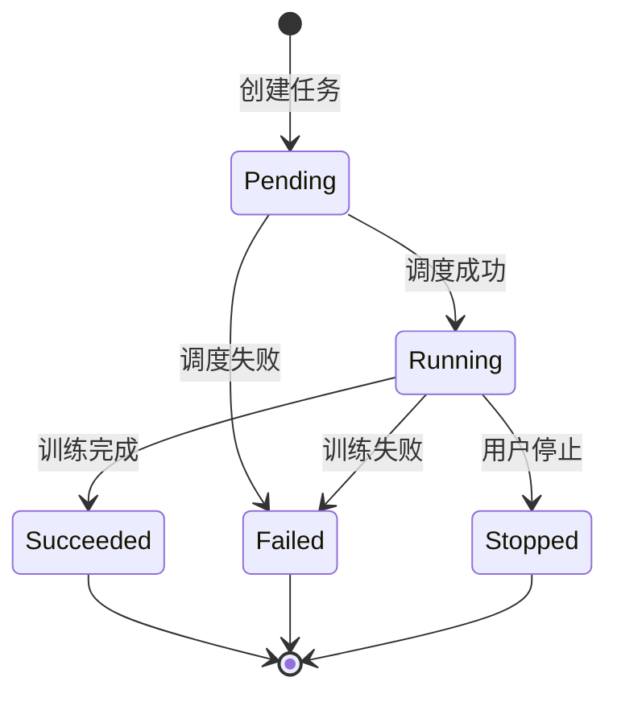
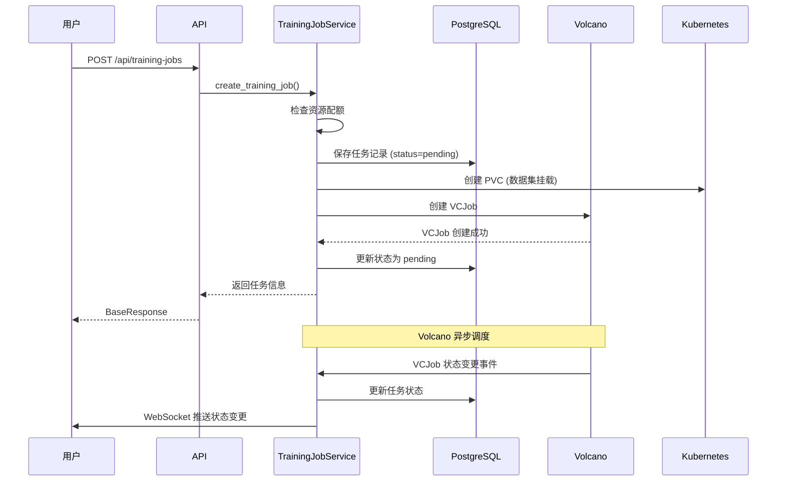

# 训练任务

## 概述

KubeAI 的训练任务功能基于 Volcano 批处理调度器，支持在 Kubernetes 上运行分布式模型训练任务，提供完整的 GPU 资源管理和任务生命周期控制。

## 核心概念

### 训练任务（TrainingJob）

训练任务代表一次模型训练过程，包含：

- 训练镜像和启动命令
- 资源配置（CPU、GPU、内存）
- 数据集挂载
- 训练日志和指标
- 状态追踪

### Volcano VCJob

KubeAI 使用 Volcano 的 VCJob 资源来调度训练任务：

- 支持排队和优先级调度
- 支持 GPU 资源管理
- 支持抢占式调度
- 支持最小可用副本数

## 任务状态流转



## 任务创建流程



## 资源配置

训练任务支持配置以下资源：

| 资源 | 配置方式 | 说明 |
|------|----------|------|
| CPU | `resources.requests.cpu` | CPU 核心数 |
| 内存 | `resources.requests.memory` | 内存大小 |
| GPU | `resources.limits.nvidia.com/gpu` | GPU 卡数 |
| 存储 | PVC 大小 | 数据集存储空间 |

资源配置受租户配额限制，超出配额时返回 `QuotaExceededException`。

## VCJob Builder

`integrations/volcano/job_builder.py` 提供 Builder 模式构建 VCJob：

```python
job = (
    VolcanoJobBuilder()
    .with_name("training-job-123")
    .with_namespace("kubeai-tenant-1")
    .with_image("pytorch/pytorch:2.1-cuda12")
    .with_command("python train.py --epochs 100")
    .with_cpu("4")
    .with_memory("16Gi")
    .with_gpu(2)
    .with_pvc("dataset-pvc", "/data")
    .build()
)
```

## 日志查看

训练任务支持实时日志查看：

1. **REST API**：`GET /api/training-jobs/{id}/logs` — 分页获取历史日志
2. **WebSocket**：`WS /api/ws` — 实时日志流推送
3. **SSE**：`GET /api/training-jobs/{id}/logs/stream` — Server-Sent Events 日志流

## GPU 指标

通过 DCGM Exporter 采集 GPU 使用指标：

- GPU 利用率
- 显存使用量
- GPU 温度
- 功耗

指标通过 WebSocket 每 30 秒推送到前端。

## 任务归档

`ResourceCleaner` 后台任务自动清理过期资源：

- 可配置最大任务保留天数
- 自动归档已完成的训练任务
- 清理关联的 PVC 和 ConfigMap

## 相关 API

| 接口 | 方法 | 说明 |
|------|------|------|
| `/api/training-jobs` | GET | 列出训练任务 |
| `/api/training-jobs` | POST | 创建训练任务 |
| `/api/training-jobs/{id}` | GET | 获取任务详情 |
| `/api/training-jobs/{id}` | DELETE | 删除任务 |
| `/api/training-jobs/{id}/stop` | POST | 停止运行中的任务 |
| `/api/training-jobs/{id}/logs` | GET | 获取任务日志 |
| `/api/training-jobs/{id}/logs/stream` | GET | SSE 日志流 |
